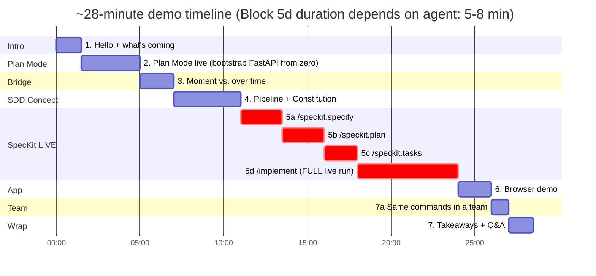
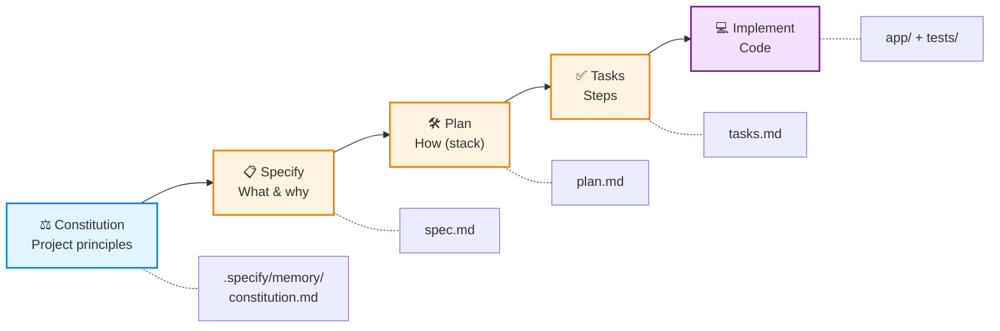
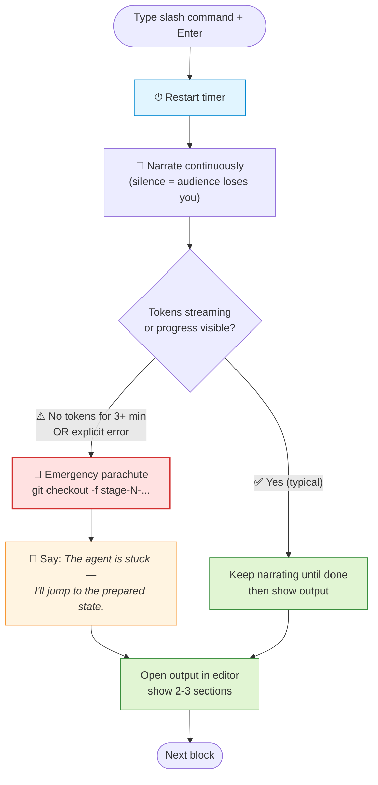

# Demo Script: Plan Mode → SDD with SpecKit (~28 min, EN)

> **Golden rule:** Don't read aloud — follow the **block cues** in bold. If you lose the thread: take a deep breath, jump to the next cue. Branches are only for true emergencies.

## 🗺 Demo map at a glance (~28 min)



> Block 5 (red) is the live phase. Block 5d (`/speckit.implement`) is the longest because the default is: **agent runs to completion**. While it runs, you narrate (see Block 5d for the arc).

---

## 🎬 Block 1 — Intro (0:00 – 1:30) · 1.5 min

**Setup:** VS Code open with empty terminal visible, slide "Vibe Coding?" projected (optional)

**Say (freely):**

> "Hello everyone. Who recognizes this: you have an idea, write a long prompt in Copilot Chat, press Enter — and 5 minutes later you have code that sort of works, but nobody knows why anymore. That is **Vibe Coding**.
>
> For small tasks, that's okay. For larger features, it becomes technical debt nobody reviewed. Today I'll show two GitHub tools for two time horizons: **Plan Mode** for the moment, **SpecKit / Spec-Driven Development** for the lifetime of a feature.
>
> In about 28 minutes: a short live Plan Mode snack, then SpecKit with a real small app — a URL shortener with click statistics."

**Cue card:**
- ⏱ **No longer than 90 sec!** If you start rambling → go directly to Block 2.
- 🎯 Goal: audience knows what's coming and why.

---

## 🎬 Block 2 — Plan Mode live (1:30 – 5:00) · 3.5 min

**Setup ahead of time:**
- Terminal open in `$HOME\demos\` (the parent folder — no demo repo prepared)
- VS Code closed, or on the welcome screen
- Copilot Chat ready in either case (Ctrl+Alt+I after you open VS Code)
- Model set to **Claude Sonnet 4.5** or **GPT-5** (most stable Plan Mode outputs)

> 💡 **Why create the folder live?** The audience sees the workflow start from a truly empty state — no hidden setup, no "I prepared this earlier". Plan Mode's job is to think *before* code exists, and now they watch that happen on a real empty folder.

**Step by step:**

**(a) Create the folder live — 30 sec**

In the terminal:
```powershell
mkdir plan-mode-demo
cd plan-mode-demo
code .
```

VS Code opens on the empty folder.

> "Empty folder. Nothing pre-made. Imagine you're starting a new microservice from scratch."

**(b) Switch Copilot Chat to Plan Mode — 20 sec**

Open Copilot Chat (Ctrl+Alt+I). In the mode dropdown at the top, switch from **Agent** to **Plan**.

> "Three modes here: Ask is chat-only, Agent edits files, Plan is read-only and returns a structured plan. We want Plan — *think before code*."

**(c) Enter prompt — 30 sec** *(see `02-prompts.md` §1)*

```
Plan only. Do not edit any files.

This folder is empty. Plan how to bootstrap a tiny FastAPI service:
- a GET /health endpoint returning {"status": "ok"}
- one pytest test that verifies status 200 and the JSON body
- use uv for dependency management

Give me: files to create, exact test cases, and risks.
```

**(d) Interpret response — 1.5 min**

While Plan Mode is streaming, keep talking (DON'T wait silently!):

> "Plan Mode does not write code here. It gives me **files to create**, **exact test cases**, and **risks** or assumptions — the review material I want before any keystroke hits a `.py` file."

When the response is there:
- Read 3 bullet points from the plan
- Point to the handoff button ("Implement Plan" or switch to Agent Mode)

> "I could click 'Implement Plan' now and Agent Mode would take this plan as context and create every file. But notice: this plan lives in the chat. Close the window and it's gone. That's the bridge to what comes next."

**Cue card:**
- ⏱ By 4:30 the plan must be there. If Plan Mode is still streaming, jump to Block 3 mid-stream — the audience already saw the point.
- 🚨 **If the Plan Mode dropdown is missing:** VS Code Insiders or latest Stable needed. Fallback: use Ask mode with the same prompt prefixed by "Don't write code — outline the plan only."
- 🚨 **If Copilot is fully down:** show the prepared screenshot from `$HOME\demos\backup\plan-mode-output.png` (created in Phase A4).
- 🎯 Goal: audience sees "chat can plan first, then let it code" — and "this plan is ephemeral".

---

## 🎬 Block 3 — Bridge (5:00 – 7:00) · 2 min

**Visual:** Close Copilot Chat. Screen shows VS Code with the mini repo. Optional: slide with two quadrants ("Plan Mode" | "SpecKit").

**Say — memorize the core sentence:**

> "Plan Mode helps me think **in the moment**, before coding. SpecKit makes sure that intent persists **over time**.
>
> That intent is versioned in the repo, reviewable in PRs, and reusable during refactorings. That is **Spec-Driven Development** — and GitHub's SpecKit is the toolkit for it."

> 💡 **Memorize the bold sentence.** Improvise the rest.

**Cue card:**
- 🎯 Key point: "plan in the moment" vs. "spec over time". Use this wording **literally** — it lands.
- ⏱ Max 2 min. Bridges are tempting to stretch. Stop at 7:00.

---

## 🎬 Block 4 — SDD concept + first artifacts (7:00 – 11:00) · 4 min

**Step by step:**

**(a) Concept slide / whiteboard — 1.5 min**

Show (best as a slide, alternatively live on the board):

```
   Constitution  →  Specify  →  Plan  →  Tasks  →  Implement
   (Principles)    (What/Why) (How)   (Steps) (Code)
        ↓             ↓          ↓        ↓           ↓
  .specify/        spec.md   plan.md  tasks.md    src/
  memory/          (Markdown in Git, reviewable in PRs)
```

> 📊 **Slide variant** of the SDD pipeline:



> "Five steps, each produces a Markdown artifact in the repo. Every later artifact is **derived from the previous one** — spec to plan, plan to tasks, tasks to code. If I change the spec later, I can regenerate plan/tasks/code."

**(b) Switch to demo repo — 30 sec**

Terminal:
```powershell
cd $HOME\demos\shortly
git checkout stage-1-after-init
code .
```

> "This is the starting repo state: `specify init` **and** `/speckit.constitution` have already run — both are one-time project setup, so we skip them."

**(c) Show `.specify/` structure — 2 min**

Expand in Explorer:
```
.specify/
├── memory/
│   └── constitution.md    ← Project principles
└── specs/                 ← (still empty)
```

> "Constitution is the project's DNA. It contains rules like 'we only use FastAPI and SQLite', 'every feature needs tests', 'no external services'. It is set once per project — and all further SpecKit commands respect it."

> 💡 **Why this command exists:** Without a constitution, every new feature picks its own stack, conventions, and opinions. The constitution gives the model persistent guardrails across every prompt in the project's lifetime.

Open `constitution.md`, scroll briefly, highlight 1–2 principles.

**Cue card:**
- ⏱ Must be in the next block by 11:00.
- 🎯 Audience understood: SDD = pipeline of Markdown artifacts in the repo.

---

## 🎬 Block 5 — SpecKit live with all commands (11:00 – 24:00) · ~13 min

> **Strategy:** All 4 SpecKit commands run **live**; the **agent runs to completion** by default so the audience sees the chat flow, streamed reasoning, and real work. Pre-staged branches are an **emergency parachute** — pull them only if a command hangs for several minutes with no token stream or errors out. While `/speckit.implement` works (5–8 min), you narrate; that long window is the point.
>
> **Before Block 5:** You are on branch **`stage-1-after-init`** — `specify init` + `/speckit.constitution` already ran beforehand (see setup checklist). This saves 90 sec and gives you a clean starting state.
>
> ⏱ **Timer setup:** A visible stopwatch is running on the second screen (phone or online timer such as `timer.onlineclock.net`). Restart the timer after pressing Enter on a slash command — that way you can tell at a glance whether the agent is making progress or has truly stalled.

### 🧭 Live decision flow (use each block's threshold)



> Thresholds are printed in each part. 5c is shorter (>2 min); the others use >3 min or hard error.

### Part 5a — `/speckit.specify` live (11:00 – 13:30) · 2.5 min

**Setup:** VS Code opened in the `shortly` repo on `stage-1-after-init`. Copilot Chat visible.

**Say:**
> "First command: `/speckit.specify`. Here I describe **what** I want to build — no tech stack, no architecture. Pure product perspective."

> 💡 **Why this command exists:** Pure user-story language, no tech. It forces a product mindset *before* anyone reaches for architecture choices — and produces a spec that PMs and designers can review too.

**Type prompt live** (or better: paste from `02-prompts.md` §2):

```
/speckit.specify Build a URL shortener web service.
Users can submit a long URL via a form and receive a short code.
Visiting the short URL redirects to the original and increments
a click counter. A stats page shows the original URL, click count
and creation date for any code. Recent shortened URLs are listed
on the home page. Single-user, no auth, no expiry.
```

**Enter → SpecKit thinks for 30–60 sec.**

**While it runs — don't go silent!**
> "SpecKit is turning the prompt into **user stories**, **acceptance criteria**, and **out of scope**. It also reads the Constitution — for example: no auth, no external services."

**When done:**
- In Explorer, click `.specify/specs/001-url-shortener/spec.md`
- Briefly scroll through three sections: **User Stories** (3), **Functional Requirements** (FR-001 through FR-008), **Out of Scope**

> "Still no 'FastAPI' or 'SQLite' here. That comes only in the next step."

**🚨 Emergency parachute (only if no tokens for > 3 min, or hard error):**
```bash
git checkout -f stage-2-after-specify
```
Say: "The agent is stuck — I'll jump to the prepared state so we don't lose momentum."

---

### Part 5b — `/speckit.plan` live (13:30 – 16:00) · 2.5 min

**Say:**
> "Second command: `/speckit.plan`. **Now** comes the tech stack. SpecKit reads the spec and my constraints and creates a technical plan."

> 💡 **Why this command exists:** Tech decisions become reviewable *before* any code exists. Cheap to change a plan in a 100-line markdown PR; expensive to change a 500-line code PR.

**Paste prompt live** (from `02-prompts.md` §3):

```
/speckit.plan Use Python 3.12 with FastAPI as the only web framework.
Use the sqlite3 standard library for persistence (no SQLAlchemy, no
Alembic). Use Jinja2 templates for minimal server-rendered HTML with
Pico.css from CDN. Tests with pytest using FastAPI's TestClient.
Single file app/main.py is preferred. Do NOT introduce: Docker,
Redis, background workers, auth, frontend build tools, or external
services.
```

**Enter → wait 30–60 sec.**

**While it runs:**
> "Here I can be strict about what must **not** be used. The model has to respect the Constitution and my plan constraints, so Docker, Redis, and SQLAlchemy stay out of this mini project."

**When done:**
- Open `.specify/specs/001-url-shortener/plan.md`
- Show section **Technical Context** (FastAPI, sqlite3, Jinja2)
- Highlight **Constitution Check** — all checkmarks
- Briefly scroll through **Project Structure**

> "The plan respects the Constitution. That is explicit — not a lucky model choice."

**🚨 Emergency parachute (only if no tokens for > 3 min, or hard error):**
```bash
git checkout -f stage-3-after-plan
```

---

### Part 5c — `/speckit.tasks` live (16:00 – 18:00) · 2 min

**Say:**
> "Third command — and now it's short. `/speckit.tasks` does not need arguments. SpecKit knows the spec and the plan; from that it generates the task list."

> 💡 **Why this command exists:** Decomposes work into reviewable, parallelizable, hand-off-able units. Without this step, you can't slice the work across developers — or hand any of it to an AI agent.

**Input:**
```
/speckit.tasks
```

**Enter → wait 30–60 sec.**

**While it runs:**
> "This is valuable for teams. With `/speckit.taskstoissues`, I can turn this list into GitHub issues — pre-assigned, each with spec context."

**When done:**
- Open `.specify/specs/001-url-shortener/tasks.md`
- Scroll through numbered task list (T001 through T014)
- Point to 2 tasks: one code task (T005), one test task (T013)
- Highlight phase section

> "Each task is small, has a clear done criterion, often with a test case. The `[P]` marker shows what can run in parallel."

**🚨 Emergency parachute (only if no tokens for > 2 min, or hard error):**
```bash
git checkout -f stage-4-after-tasks
```

---

### Part 5d — `/speckit.implement` (full live run, 18:00 – 24:00) · ~6 min

**Say — explain beforehand (20 sec):**
> "Last command: `/speckit.implement`. SpecKit reads spec, plan, and tasks and **builds the app**. The agent runs to completion; expect five to eight minutes. While it runs, watch how each file traces back to an artifact we already reviewed."

> 💡 **Why this command exists:** Code is now deterministically derived from artifacts that survived review. Change the spec → regenerate the plan → regenerate tasks → regenerate code. The audit trail is built in, not bolted on.

**Input:**
```
/speckit.implement
```

**Enter → agent starts working.**

You now have a **5–8 minute live window** where the speaker drives the narrative and the agent drives the code. Don't go silent. Use the time:

**Narration arc (loose, adapt to what's appearing on screen):**

| Minute | Stage / what to show | What to say |
|--------|----------------------|-------------|
| 0:00–1:00 | First files appear — `pyproject.toml`, `app/__init__.py`, `app/db.py` | "SpecKit is working through `tasks.md` in dependency order — the list we just reviewed. Persistence comes first because routes depend on it." |
| 1:00–2:30 | Routes show up in `app/main.py` (POST shorten, GET redirect, GET stats) | Open `spec.md` side-by-side with the new `main.py`. Point: "FR-002 said 6-character codes — and there it is in the code. FR-005 said click counter — see the `UPDATE clicks` statement." |
| 2:30–4:00 | Tests get written | Open `tasks.md` and scroll: checkmarks are appearing. "Order matters: data layer → routes → templates → tests. That's the dependency order tasks.md declared." |
| 4:00–5:30 | Templates land (`index.html`, `stats.html`) + agent runs `pytest` itself | "Watch the chat — it just executed the test suite. Green. Tasks T012–T014 asked for integration tests, so the agent wrote and ran them." |
| 5:30–7:00 | If still running: show `constitution.md`, `spec.md`, `tasks.md` traceability | "This is why the wait is useful: we can watch constraints become code instead of trusting a black box." |
| 7:00–done | Agent reports completion, or keep narrating if still streaming | "Stay with the stream. As long as tokens are moving, the default remains: agent runs to completion." |

**While narrating, also do (parallel activities — pick what fits):**
- Re-open `constitution.md`, point to one principle, then point to the code and say "see — no Docker, no Redis, no ORM. The Constitution held."
- Run `git status` in the terminal to show the new file list growing.
- Open `tasks.md` and visibly scroll as checkmarks appear.
- Acknowledge audience body language — if you see confusion, pause your monologue and let the agent's output speak for itself for 20 seconds.
- If you need another 30 seconds, repeat the trace: spec → plan → tasks → code, using the files already open.

**When the agent finishes:**
- Briefly open `app/main.py`, point to 1 route.
- Briefly open `tests/test_app.py`, point to 1 test.
- Run `git log --oneline` if a commit appears; otherwise show `git status --short` and keep moving.

> "Every file you see is connected to an artifact that justified it. If tomorrow someone asks 'why do you use 6-character codes?' — the answer is in **FR-002**. The code is the derivative; the spec is the source."

**Cue card Block 5:**
- ⏱ Target: Block 6 around ~24:00. If the agent is still streaming, keep narrating; only parachute at the thresholds below.
- 🚨 Emergency parachute **only if** no token stream for > 3 min OR explicit error after retries OR you've overshot 30 min total. Then: Stop button → `git checkout -f stage-5-complete`.
- 🎯 Audience has seen **all 4 SpecKit commands** and the agent translating spec → app end-to-end.

---

## 🎬 Block 6 — Test app live (24:00 – 26:00) · 2 min

**Step by step:**

**(a) Start — 30 sec**
```bash
uv run uvicorn app.main:app --reload
```
(or `python -m uvicorn app.main:app --reload`)

Open browser tab at `http://localhost:8000`.

**(b) Shorten URL — 30 sec**
- Enter long URL (e.g. `https://github.com/github/spec-kit`)
- Click "Shorten" → short code appears

**(c) Click + stats — 1 min**
- Click short URL → redirects (new tab)
- Go back, click stats link for the code
- Click counter is at 1
- Redirect again, refresh stats → 2

> "Three endpoints, full workflow, all derived from a Markdown spec. If tomorrow I say 'click statistics should be grouped daily' — I update the spec, regenerate plan and tasks, and Copilot knows what needs to change."

**(d) Use buffer time — until 26:00**

If everything went smoothly: briefly show `tests/test_app.py` — the tests are generated from the tasks too.

**🚨 Fallback if app does not start:**
- In the 2nd terminal tab, you had it **already running** (see setup checklist!)
- Browser tab already open → simply switch there, say: "The finished version is running here"

**Cue card:**
- ⏱ Spend 2 min max; if `/speckit.implement` ran long, do one shorten + one stats refresh.
- 🎯 Prove the generated app works.

---

## 🎬 Block 7a — Same commands, split across a team (26:00 – 27:00) · 1 min

> **Why this block exists:** The audience just saw a one-person loop. The real question they're thinking is "how would this work with multiple features and multiple developers?" Answer in 60 seconds — then point to `06-team-workflow.md` for the deep dive.

**Slide:** show the Team Workflow slide (8/9) — four cards: *one constitution + many feature folders*, *review 3× on cheap artifacts*, *roles map to artifacts*, *AI as async teammate*.

**Say (60 sec, memorize):**
> "The same five commands scale to a distributed team. Three points:
>
> **One.** Each feature gets its own `.specify/specs/NNN-name/` folder. Three developers can run `/speckit.specify`, `/speckit.plan`, `/speckit.tasks`, `/speckit.implement` in parallel — zero merge conflicts on artifacts.
>
> **Two.** Each artifact gets its own PR. Product reviews the spec. Tech Lead reviews the plan. Devs review the tasks. By the time you're reviewing code, the hard decisions are already settled — code review becomes a sanity check, not a 500-line debate.
>
> **Three.** `/speckit.taskstoissues` turns the tasks file into GitHub Issues. Label one `ai-implement` and Copilot's cloud agent claims it, runs `/speckit.implement` on that slice, and opens a PR. AI becomes a junior dev who works async. The spec/plan/tasks chain *is* the context."

> 📖 **Pointer:** "Full week-in-the-life example, hand-off diagram, and anti-patterns are in `06-team-workflow.md` in the repo."

**Cue card:**
- ⏱ Hard cap 60 sec. If you overshoot, the wrap-up gets squeezed.
- 🎯 Audience leaves knowing this works for teams, not just for solo demos.

---

## 🎬 Block 7 — Wrap-up & Q&A (27:00 – 28:30) · 1.5 min

**Three takeaways — memorize:**

> "Three things to take away:
>
> 1. **Plan Mode** turns a prompt into a planned session — tactical, in the moment.
> 2. **SpecKit** turns planning into versioned project artifacts — strategic, over time.
> 3. **The spec is the executable artifact** — not the code. Code becomes disposable when the spec lives.
>
> Links: `github.com/github/spec-kit` — installation in 30 seconds with `uv`. Works with 30+ AI agents, not just Copilot.
>
> **And if you live in the terminal:** the same slash commands run 1:1 in the GitHub Copilot CLI — no tool switch needed.
>
> Questions?"

**Cue card:**
- ⏱ Aim to close around 28:30; if `/speckit.implement` ran long, close by 30:00 and move Q&A elsewhere.
- 🎯 Everyone in the room can retell the core message in one sentence.

---

## 🆘 Universal emergency cheat sheet lines

Use these **only** if the agent is truly stuck (no tokens for several minutes, or hard error) — not because it feels slow:

- "The agent is stuck — I'll jump to the prepared state."
- "This is why I version the specs — the next step is ready in the branch."
- "Live demos are honest — and Spec-Driven means the state is reproducible."

## Pace checkpoints (note on cheat sheet!)

| When the clock shows … | … you should be in … |
|----------------------|--------------------------|
| 1:30 | Block 2 (Plan Mode) |
| 5:00 | Block 3 (Bridge) |
| 7:00 | Block 4 (SDD concept) |
| 11:00 | Block 5a (`/speckit.specify` LIVE) |
| 13:30 | Block 5b (`/speckit.plan` LIVE) |
| 16:00 | Block 5c (`/speckit.tasks` LIVE) |
| 18:00 | Block 5d (`/speckit.implement` LIVE, full run) |
| ~24:00 | Block 6 (test app) — exact moment depends on agent speed (5–8 min for `/speckit.implement`) |
| ~26:00 | Block 7a (team workflow, 60 sec) |
| ~27:00 | Block 7 (Wrap-up) — slides later if `/speckit.implement` used the full 8 min |
| ~28:30 | Done target (25–30 min range) |

> **Total demo wall-clock**: ~28 min, with a natural range of 25–30 min driven by `/speckit.implement`. If it finishes faster, use the extra time to scroll through the constitution + spec one more time before Block 6. If it overshoots 30 min, **then** parachute to `stage-5-complete` and finish.
