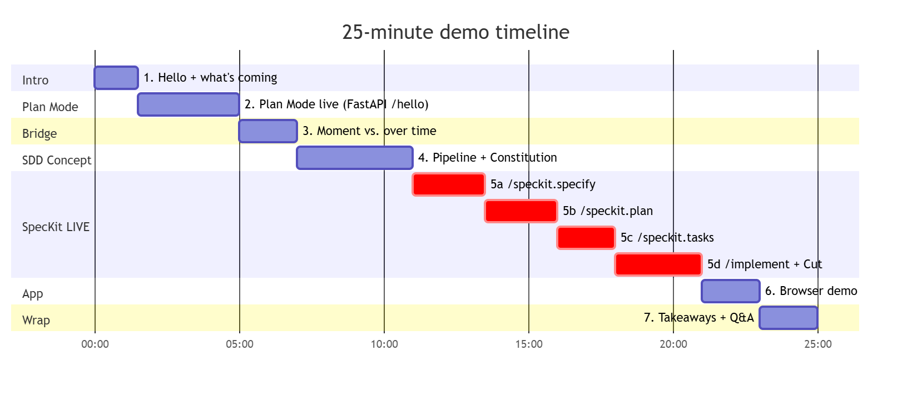
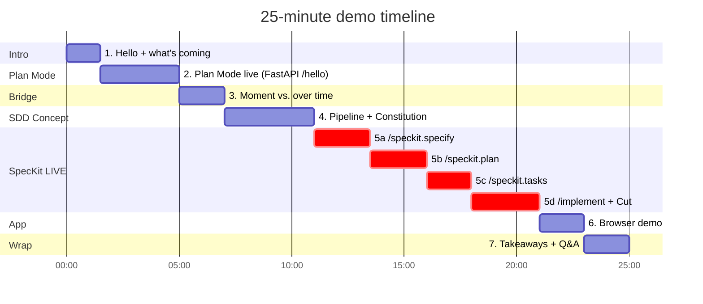
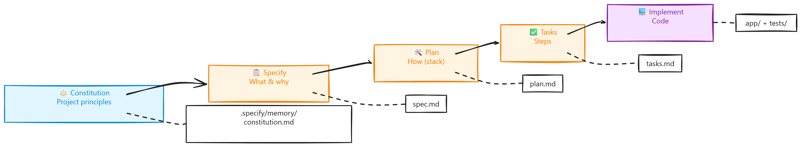
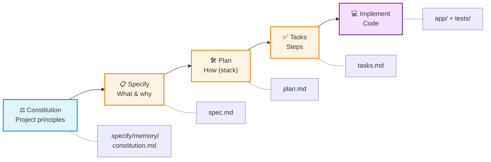
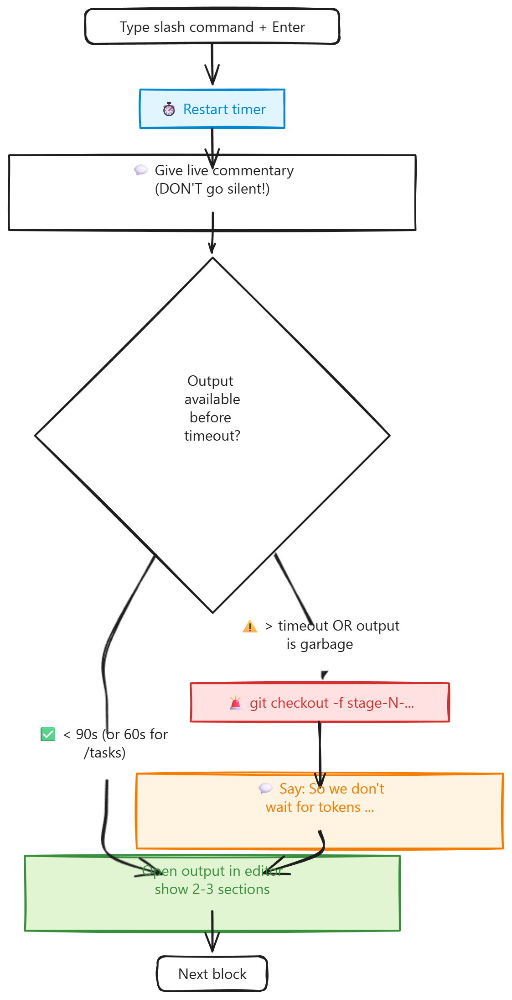
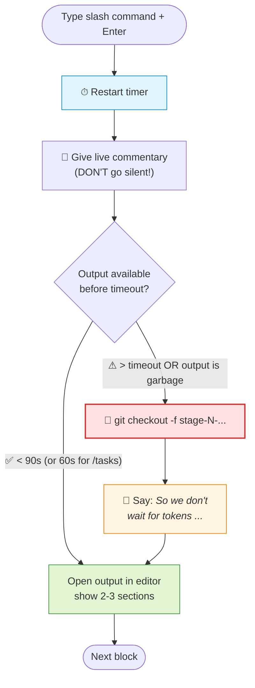

# Demo Script: Plan Mode → SDD with SpecKit (25 min, EN)

> **Golden rule:** Don't read aloud — follow the **block cues** in bold. If you lose the thread: take a deep breath, jump to the next cue, use the branch fallback.

## 🗺 Demo map at a glance (25 min)



<details>
<summary>📐 Mermaid source text (editable)</summary>



</details>

> 💡 PNG is rendered in the VS Code Markdown preview. If you adjust the source text, rerun `pwsh -File scripts/regen-diagrams.ps1` in the repo root (see `scripts/README.md`). Block 5 (red) is the required live phase — if you are > 60 sec behind from here on: bailout branch.

---

## 🎬 Block 1 — Intro (0:00 – 1:30) · 1.5 min

**Setup:** VS Code open with empty terminal visible, slide "Vibe Coding?" projected (optional)

**Say (freely):**

> "Hello everyone. Who recognizes this: you have an idea, write a long prompt in Copilot Chat, press Enter — and 5 minutes later you have code that sort of works, but nobody really knows why anymore. That is called **Vibe Coding**.
>
> For small tasks, that's okay. For larger features, it quickly turns into technical debt that nobody reviewed. Today I'll show you two tools from GitHub that address exactly this problem on different time horizons: **Plan Mode** for the moment, **SpecKit / Spec-Driven Development** for the lifetime of a feature.
>
> In 25 minutes: a short live Plan Mode snack, then a deeper dive into SpecKit with a real small app — a URL shortener with click statistics."

**Cue card:**
- ⏱ **No longer than 90 sec!** If you start rambling → go directly to Block 2.
- 🎯 Goal: audience knows what's coming and why.

---

## 🎬 Block 2 — Plan Mode live (1:30 – 5:00) · 3.5 min

**Setup ahead of time:**
- VS Code opened in the prepared repo `plan-mode-demo/` (see setup checklist)
- The repo contains a tiny FastAPI app with a `/hello` endpoint
- Copilot Chat is open (Ctrl+Alt+I or Cmd+Ctrl+I)
- Model set to **Claude Sonnet 4.5** or **GPT-5** (most stable Plan Mode outputs)

**Step by step:**

**(a) Show setup — 30 sec**
> "This is a tiny FastAPI app with one endpoint. We want to add a `/health` endpoint with a test — a minimal task, but we're approaching it in a structured way."

Briefly open `main.py`, scroll, close.

**(b) Show Plan Mode toggle — 20 sec**

In Copilot Chat at the top, switch the **Agent/Ask dropdown** to **"Plan"**.

> "Here is the difference: instead of Agent — which edits directly — we switch to **Plan**. Plan Mode only has read tools, cannot change anything, and is trained to return a structured plan."

**(c) Enter prompt — 1 min** *(Prompt → see `02-prompts.md` §1)*

```
Plan only. Do not edit any files.

We have a FastAPI URL shortener (currently just /hello).
Plan how to add:
- a GET /health endpoint returning {"status": "ok"}
- one pytest test that verifies status 200 and the JSON body

Give me: files to touch, exact test cases, and risks.
```

**(d) Interpret response — 1.5 min**

While Copilot is typing, keep talking (DON'T wait silently!):

> "Notice that Plan Mode does not write code. Instead it provides **files to touch**, **test cases**, and ideally **risks** or assumptions. That is exactly the kind of review material I want to see before coding."

When the response is there:
- Read 3 bullet points from the plan
- Point to the handoff button ("Implement Plan" or switch to Agent Mode)

> "I could now click 'Implement' directly — the plan is passed along as context. But I won't, because we're about to see something more powerful."

**Cue card:**
- ⏱ By 4:30 the plan must be there. Otherwise: show prepared screenshot ("this is what it usually looks like") and move on.
- 🚨 **If the Plan Mode dropdown is missing:** VS Code Insiders or latest Stable needed. Fallback: show a short screenshot from `$HOME\demos\backup\plan-mode-output.png` (create screenshot beforehand in Phase A4!).
- 🎯 Goal: audience sees "chat can plan first, then let it code".

---

## 🎬 Block 3 — Bridge (5:00 – 7:00) · 2 min

**Visual:** Close Copilot Chat. Screen shows VS Code with the mini repo. Optional: slide with two quadrants ("Plan Mode" | "SpecKit").

**Say — memorize the core sentence:**

> "Plan Mode helps me think **in the moment**, before coding. SpecKit makes sure that intent persists **over time** — versioned in the repo, reviewable in PRs, reusable during refactorings.
>
> That is called **Spec-Driven Development** — and GitHub's SpecKit is the toolkit for it."

> 💡 **Really know the bold sentence by heart.** The rest is improvisation around it.

**Cue card:**
- 🎯 Key point: "plan in the moment" vs. "spec over time". Use this wording **literally** — it lands.
- ⏱ Max 2 min. Bridges are tempting to stretch. Stop at 7:00.

---

## 🎬 Block 4 — SDD concept + first artifacts (7:00 – 11:00) · 4 min

**Step by step:**

**(a) Concept slide / whiteboard — 1.5 min**

Show (best as a slide, alternatively live on the board):

```
   Constitution  →  Specify  →  Plan  →  Tasks  →  Implement
   (Principles)    (What/Why) (How)   (Steps) (Code)
        ↓             ↓          ↓        ↓           ↓
  .specify/        spec.md   plan.md  tasks.md    src/
  memory/          (Markdown in Git, reviewable in PRs)
```

> 📊 **Slide variant** of the SDD pipeline (use this screenshot as slide foundation):



<details>
<summary>📐 Mermaid source text (editable)</summary>



</details>

> "Five steps, each produces a Markdown artifact in the repo. The special part: every later artifact is **derived from the previous one** — the spec generates the plan, the plan the tasks, the tasks the code. If I change the spec later, I can regenerate plan/tasks/code."

**(b) Switch to demo repo — 30 sec**

Terminal:
```powershell
cd $HOME\demos\shortly
git checkout stage-1-after-init
code .
```

> "Here I am on a prepared state: `specify init` **and** `/speckit.constitution` have already run — both are one-time project setup, so we skip them."

**(c) Show `.specify/` structure — 2 min**

Expand in Explorer:
```
.specify/
├── memory/
│   └── constitution.md    ← Project principles
└── specs/                 ← (still empty)
```

> "Constitution is basically the project's DNA. It contains rules like 'we only use FastAPI and SQLite', 'every feature needs tests', 'no external services'. It is set once per project — and all further SpecKit commands respect it."

Open `constitution.md`, scroll briefly, highlight 1–2 principles.

**Cue card:**
- ⏱ Must be in the next block by 11:00.
- 🎯 Audience understood: SDD = pipeline of Markdown artifacts in the repo.

---

## 🎬 Block 5 — SpecKit live with all commands (11:00 – 21:00) · 10 min

> **Strategy:** All 4 SpecKit commands are run **live** so the audience sees the chat-interface flow. Pre-staged branches are a **safety net** with a 10-second bailout, not the main stage. Only compromise: `/speckit.implement` is **started** live (audience sees the beginning), then after 30 sec we switch to `stage-5-complete`.
>
> **Before Block 5:** You are on branch **`stage-1-after-init`** — `specify init` + `/speckit.constitution` already ran beforehand (see setup checklist). This saves 90 sec and gives you a clean starting state.
>
> ⏱ **Timer setup:** A visible stopwatch is running on the second screen (phone or online timer such as `timer.onlineclock.net`). Restart the timer after pressing Enter on a slash command — that way you always know when the 30/60/90-sec mark is reached without leafing through the script.

### 🧭 Live decision flow (same for each of the 4 commands)



<details>
<summary>📐 Mermaid source text (editable)</summary>



</details>

### Part 5a — `/speckit.specify` live (11:00 – 13:30) · 2.5 min

**Setup:** VS Code opened in the `shortly` repo on `stage-1-after-init`. Copilot Chat visible.

**Say:**
> "First command: `/speckit.specify`. Here I describe **what** I want to build — no tech stack, no architecture. Pure product perspective."

**Type prompt live** (or better: paste from `02-prompts.md` §2):

```
/speckit.specify Build a URL shortener web service.
Users can submit a long URL via a form and receive a short code.
Visiting the short URL redirects to the original and increments
a click counter. A stats page shows the original URL, click count
and creation date for any code. Recent shortened URLs are listed
on the home page. Single-user, no auth, no expiry.
```

**Enter → SpecKit thinks for 30–60 sec.**

**While it runs — don't go silent!**
> "Notice what SpecKit is doing right now: it breaks the prompt into **user stories**, **acceptance criteria**, and explicitly defines **out of scope**. It reads the Constitution we prepared — for example, that says 'no auth, no external services'."

**When done:**
- In Explorer, click `.specify/specs/001-url-shortener/spec.md`
- Briefly scroll through three sections: **User Stories** (3), **Functional Requirements** (FR-001 through FR-008), **Out of Scope**

> "Notice: not a single 'FastAPI' or 'SQLite' here. That comes only in the next step."

**🚨 Bailout at > 90 sec:**
```bash
git checkout stage-2-after-specify
```
Say: "So we don't wait for tokens, let's jump to the state as it would look in a moment."

---

### Part 5b — `/speckit.plan` live (13:30 – 16:00) · 2.5 min

**Say:**
> "Second command: `/speckit.plan`. **Now** comes the tech stack. SpecKit reads the spec and my constraints and creates a technical plan."

**Paste prompt live** (from `02-prompts.md` §3):

```
/speckit.plan Use Python 3.12 with FastAPI as the only web framework.
Use the sqlite3 standard library for persistence (no SQLAlchemy, no
Alembic). Use Jinja2 templates for minimal server-rendered HTML with
Pico.css from CDN. Tests with pytest using FastAPI's TestClient.
Single file app/main.py is preferred. Do NOT introduce: Docker,
Redis, background workers, auth, frontend build tools, or external
services.
```

**Enter → wait 30–60 sec.**

**While it runs:**
> "Here you see a strength: I can be strict about what must **not** be used. The model respects the Constitution AND my plan constraints. That prevents Docker, Redis, and SQLAlchemy from suddenly being dragged into my mini project."

**When done:**
- Open `.specify/specs/001-url-shortener/plan.md`
- Show section **Technical Context** (FastAPI, sqlite3, Jinja2)
- Highlight **Constitution Check** — all checkmarks
- Briefly scroll through **Project Structure**

> "The plan respects the Constitution. That is explicit — not an implicit 'the model just happened to do the right thing'."

**🚨 Bailout at > 90 sec:**
```bash
git checkout stage-3-after-plan
```

---

### Part 5c — `/speckit.tasks` live (16:00 – 18:00) · 2 min

**Say:**
> "Third command — and now it's short. `/speckit.tasks` does not need arguments. SpecKit knows the spec and the plan; from that it generates the task list."

**Input:**
```
/speckit.tasks
```

**Enter → wait 30–60 sec.**

**While it runs:**
> "This is the step that is especially valuable for teams. With `/speckit.taskstoissues`, I can create the task list directly as GitHub issues — pre-assigned, each issue with its spec context."

**When done:**
- Open `.specify/specs/001-url-shortener/tasks.md`
- Scroll through numbered task list (T001 through T014)
- Point to 2 tasks: one code task (T005), one test task (T013)
- Highlight phase section

> "Each task is small, has a clear done criterion, often directly with a test case. The `[P]` marker shows what can run in parallel."

**🚨 Bailout at > 60 sec:**
```bash
git checkout stage-4-after-tasks
```

---

### Part 5d — Start `/speckit.implement` live, then jump (18:00 – 21:00) · 3 min

**Say — explain beforehand (15 sec), this is important:**
> "Last command: `/speckit.implement`. I'll start it **live** so you can see how it begins. A **complete** implementation takes 5–8 minutes here — we don't have that time. After about 30 seconds, once you see the first files appear, I'll jump to the already-executed final state. Promise: the code there is derived from **exactly this** spec, this plan, and these tasks."

**Input:**
```
/speckit.implement
```

**Enter → WATCH for 30 sec.**

**While it runs — live commentary (important, keeps tension):**
> "See in the left sidebar: the first files are being created — `pyproject.toml`, `app/__init__.py`, `app/db.py`. SpecKit works through the tasks **in dependency order**, which we just saw in `tasks.md`."

**After 30 sec — cut to final state:**
> "That's exactly what we wanted to see. Now I'll jump to the finished branch — the point is not to watch 8 minutes of typing, but that the Spec→Code connection is traceable."

**Cut routine (in this order!):**
1. Click the **Stop button** in Copilot Chat (red square at the top right of the chat input) — otherwise `/implement` keeps running in the background and consumes quota.
2. **In terminal:**
   ```powershell
   git checkout -f stage-5-complete
   ```

**In VS Code Explorer:**
- Expand app structure: `app/`, `tests/`, `pyproject.toml`
- Briefly open `app/main.py`, point to 1 route
- Briefly open `tests/test_app.py`, point to 1 test
- Run `git log --oneline` in terminal

> "Look: every commit is connected to the artifact that justified it. If tomorrow someone asks 'why do you use 6-character codes?' — the answer is in **FR-002** of the spec."

**Cue card Block 5:**
- ⏱ By 21:00 the code **must** be visible and Block 6 (app live) must start
- 🚨 Every bailout branch jump in under 10 sec
- 🎯 Audience has seen **all 4 SpecKit commands** in action — chat interface, streaming output, Markdown generation — and the connection to real code

---

## 🎬 Block 6 — Test app live (21:00 – 23:00) · 2 min

**Step by step:**

**(a) Start — 30 sec**
```bash
uv run uvicorn app.main:app --reload
```
(or `python -m uvicorn app.main:app --reload`)

Open browser tab at `http://localhost:8000`.

**(b) Shorten URL — 30 sec**
- Enter long URL (e.g. `https://github.com/github/spec-kit`)
- Click "Shorten" → short code appears

**(c) Click + stats — 1 min**
- Click short URL → redirects (new tab)
- Go back, click stats link for the code
- Click counter is at 1
- Redirect again, refresh stats → 2

> "Three endpoints, full workflow, all derived from a Markdown spec. And if tomorrow I say 'click statistics should be grouped daily' — I update the spec, regenerate plan and tasks, and Copilot knows exactly what needs to change."

**(d) Use buffer time — until 23:00**

If everything went smoothly: briefly show `tests/test_app.py` — the tests are generated from the tasks too.

**🚨 Fallback if app does not start:**
- In the 2nd terminal tab, you had it **already running** (see setup checklist!)
- Browser tab already open → simply switch there, say: "The finished version is running here"

---

## 🎬 Block 7 — Wrap-up & Q&A (23:00 – 25:00) · 2 min

**Three takeaways — memorize:**

> "Three things to take away:
>
> 1. **Plan Mode** turns a prompt into a planned session — tactical, in the moment.
> 2. **SpecKit** turns planning into versioned project artifacts — strategic, over time.
> 3. **The spec is the executable artifact** — not the code. Code becomes disposable when the spec lives.
>
> Links: `github.com/github/spec-kit` — installation in 30 seconds with `uv`. Works with 30+ AI agents, not just Copilot.
>
> **And if you live in the terminal:** the same slash commands run 1:1 in the GitHub Copilot CLI — no tool switch needed.
>
> Questions?"

**Cue card:**
- ⏱ **Do not go over 25:00!** Q&A can continue elsewhere if needed.
- 🎯 Everyone in the room can retell the core message in one sentence.

---

## 🆘 Universal emergency cheat sheet lines

If something hangs or breaks, **silently switch to the fallback** and say one of these lines while doing it:

- "So we don't wait for tokens, let's jump to the deterministic state."
- "Exactly for cases like this, I version the specs — the next step is ready in the branch."
- "Live demos are honest — and that is exactly the advantage of Spec-Driven: the state is reproducible."

## Pace checkpoints (note on cheat sheet!)

| When the clock shows … | … you should be in … |
|----------------------|--------------------------|
| 1:30 | Block 2 (Plan Mode) |
| 5:00 | Block 3 (Bridge) |
| 7:00 | Block 4 (SDD concept) |
| 11:00 | Block 5a (`/speckit.specify` LIVE) |
| 13:30 | Block 5b (`/speckit.plan` LIVE) |
| 16:00 | Block 5c (`/speckit.tasks` LIVE) |
| 18:00 | Block 5d (`/speckit.implement` LIVE START) |
| 21:00 | Block 6 (test app) |
| 23:00 | Block 7 (Wrap-up) |

If you are **more than 60 sec behind schedule** → take the bailout branch directly for the next live command, without waiting.
