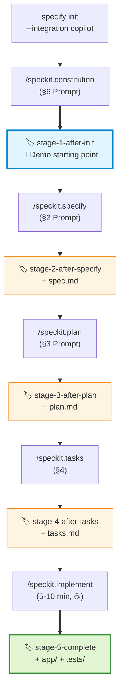

# Setup Checklist

> **2 phases:** (A) Monday evening at the latest, (B) 30 min before demo. Nothing at the last minute.

---

## 🅐 Day before the demo (Monday)

### A1 — Verify tools (10 min)

- [ ] **VS Code up to date** — `Help → About`, at least v1.110 (Plan Mode dropdown needs current Stable)
- [ ] **GitHub Copilot Extension** active and signed in — Plan Mode visible in the chat mode dropdown?
  - If there is no Plan Mode dropdown: VS Code → Settings → Search "chat modes" → enable the Plan Mode feature
- [ ] **GitHub Copilot CLI** (for a one-sentence note in the Wrap-up): `copilot --version`
- [ ] **Python 3.12** — `python --version`
- [ ] **uv** installed — `uv --version`
- [ ] **SpecKit CLI** installed — `specify --version`
  ```powershell
  uv tool install specify-cli --from git+https://github.com/github/spec-kit.git
  ```

### A2 — Prepare demo repos (45 min)

**Repo 1: `plan-mode-demo/` (for Block 2)**

- [ ] Copy mini FastAPI skeleton from `04-plan-b/mini-skeleton/`
- [ ] `cd plan-mode-demo && uv venv && uv pip install -r requirements.txt`
- [ ] Quick test: `uv run uvicorn main:app --reload` → `http://localhost:8000/hello` responds
- [ ] `git init && git add . && git commit -m "FastAPI skeleton with /hello"`

**Repo 2: `shortly/` (for Blocks 4–6)**

> 🎯 **Purpose of the branches:** They are **SAFETY NETS** for live demos. During the demo, you run all SpecKit commands **live** (the audience wants to see that). If a command hangs > 90 sec, force-checkout the branch and continue.
>
> 🏷 **Naming note:** The branch is called `stage-1-after-init`, but it contains both `specify init` **and** `/speckit.constitution`. Both are one-time project setup that you save yourself on stage — so they are grouped together as the shared starting point.

### 🌿 Branch chain overview



After each slash command: `git add . && git commit -m "stage-N-..."`, then `git branch stage-N-...`.

- [ ] `specify init shortly --integration copilot`
- [ ] `cd shortly`
- [ ] Open in VS Code, open Copilot Chat
- [ ] Run `/speckit.constitution` with prompt from `02-prompts.md` §6
- [ ] Commit: `git add . && git commit -m "stage-1-after-init: init + constitution"`
- [ ] Set branch: `git branch stage-1-after-init`
- [ ] Run `/speckit.specify` with prompt from §2
- [ ] **Validate content** (3 user stories present, acceptance criteria clear)
- [ ] Commit + branch: `stage-2-after-specify`
- [ ] `/speckit.plan` with prompt from §3
- [ ] **Validate content** (FastAPI + sqlite3 + Jinja2, no ORMs)
- [ ] Commit + branch: `stage-3-after-plan`
- [ ] `/speckit.tasks`
- [ ] Commit + branch: `stage-4-after-tasks`
- [ ] Run `/speckit.implement` (can take **5–10 min** — coffee break)
- [ ] Test app: `uv run uvicorn app.main:app --reload`
  - URL shortening works?
  - Redirect works?
  - Click counter increments?
  - Stats page shows correct numbers?
- [ ] **If the implementation does not run / has bugs:** copy in code from `04-plan-b/final-app/` (see `04-plan-b/final-app/README.md` → section "Demo emergency: copy code into live repo" for the exact `robocopy` commands)
- [ ] Commit + branch: `stage-5-complete`
- [ ] **Check list of all branches:** `git branch` shows stage-1 through stage-5

### A2b — Slash-command rehearsal (20 min) — **IMPORTANT**

> You only practice the **live slash commands** on a **second** throw-away repo so you know timing and outputs from your own experience. (The full 25-minute demo rehearsal comes in A5.)

- [ ] `cd $HOME\demos && specify init shortly-rehearsal --integration copilot`
- [ ] `cd shortly-rehearsal`, open in VS Code, open Copilot Chat
- [ ] `/speckit.constitution` with §6 prompt — **start stopwatch**
- [ ] `/speckit.specify` with §2 prompt — **note seconds** (expected: 30–90s)
- [ ] `/speckit.plan` with §3 prompt — note seconds
- [ ] `/speckit.tasks` — note seconds
- [ ] `/speckit.implement` — **watch only 60 sec, then Stop button in chat** (red square at the top right of the chat input)
- [ ] Enter values in table:

  | Command | Seconds | Output quality ok? |
  |---------|----------|---------------------|
  | /speckit.constitution | _____ | ☐ yes ☐ no |
  | /speckit.specify | _____ | ☐ yes ☐ no |
  | /speckit.plan | _____ | ☐ yes ☐ no |
  | /speckit.tasks | _____ | ☐ yes ☐ no |

- [ ] If **sum > 4 min** (= 240s for 4 commands): switch model (VS Code Chat → model dropdown at the bottom of the chat input) to the currently fastest available model with the same quality
- [ ] If you have problems with a specific command: note it; in the demo, take the bailout branch directly after announcing the command instead of waiting live
- [ ] **Practice force-checkout pattern:**
  ```powershell
  git checkout -f stage-2-after-specify   # -f discards uncommitted changes
  ```
  Run through it 3× until it sticks
- [ ] **Cleanup after rehearsal:** `cd $HOME\demos && Remove-Item -Recurse -Force shortly-rehearsal` (otherwise you may confuse the repos on demo day)

### A3 — Rehearse branch jumps (15 min)

- [ ] Run through 3×: `git checkout -f stage-2 → stage-3 → stage-4 → stage-5` without looking
- [ ] **Important: use the `-f` flag!** Otherwise git complains about uncommitted changes after live commands
- [ ] On each checkout: VS Code Explorer shows the correct `.specify/specs/...` files?
- [ ] `uv run uvicorn app.main:app --reload` on `stage-5` starts cleanly?

### A4 — Backup materials (10 min)

> 📁 **Storage location:** Put all backups in a folder `$HOME\demos\backup\` — easy to find on demo day.

- [ ] **Screenshot** of successful Plan Mode output → `$HOME\demos\backup\plan-mode-output.png`
- [ ] **Screenshots** of successful `spec.md`, `plan.md`, `tasks.md` → `$HOME\demos\backup\{spec,plan,tasks}.png`
- [ ] **Screen recording** (2 min) of the working app as an absolute fallback → `$HOME\demos\backup\shortly-demo.mp4`
- [ ] Print cheat sheet `02-prompts.md` **or** open it on second screen
- [ ] Backup USB stick with the `backup\` folder — in case the laptop fails

### A5 — Full dress rehearsal of the entire demo (20 min)

> Complete 25-minute run-through on the real `shortly/` repo (not the rehearsal repo from A2b). Here you practice the **flow + timing**, not the slash commands themselves anymore.

- [ ] **Talk through the complete demo once alone**, with stopwatch
- [ ] Mark overflow spots — where do you need to tighten up?
- [ ] If > 26 min: where to cut? (Recommendation: shorten Block 5c)
- [ ] Run through branch jumps (`stage-2` → ... → `stage-5-complete`) at least once so the muscle memory sticks

---

## 🅑 30 minutes before the demo (Tuesday)

### B1 — Hardware (5 min)

- [ ] Laptop plugged in
- [ ] External screen / projector works, resolution set
- [ ] VS Code zoom at **+3** (Ctrl+= three times) — check terminal font size
- [ ] Browser zoom at **125%**
- [ ] **Do not mute the mic 🙂**

### B2 — Open apps ahead of time, in order (10 min)

1. **Terminal tab 1:** `cd $HOME\demos\plan-mode-demo` (Block 2)
2. **VS Code window A:** `plan-mode-demo\` opened, `main.py` as active tab, Copilot Chat open
3. **Terminal tab 2:** `cd $HOME\demos\shortly` (Blocks 4–6)
4. **VS Code window B:** `shortly\` on branch `stage-1-after-init` (so only `specify init` + `/speckit.constitution`, NO spec/plan/tasks — those come live), Explorer with `.specify\` expanded
5. **Terminal tab 3:** in `shortly\` with app already running on port 8001 (`uv run uvicorn app.main:app --port 8001 --reload`) — as the ULTIMATE app fallback
   - If port is occupied: `--port 8002` and adjust Browser tab 1 accordingly
6. **Browser tab 1:** `http://localhost:8001` (shows your already-running backup app — should show the index page)
7. **Browser tab 2:** `http://localhost:8000` (for the "real" app in Block 6 — you start it live; currently "connection refused" — that is expected)
8. **Browser tab 3:** `https://github.com/github/spec-kit` (for Wrap-up link reference)
9. **Cheat sheet:** `02-prompts.md` on second screen or paper
10. **Stopwatch/timer** visible on second screen (phone or `timer.onlineclock.net`) — for the 30/60/90-sec marks in Block 5

### B3 — Smoke test (5 min)

- [ ] `git status` in both repos = clean
- [ ] `git branch` in `shortly\` shows all stage-1 through stage-5
- [ ] Copilot Chat responds in **both** VS Code windows (type a short test question, e.g. "hi")
- [ ] Browser tab 1 (`http://localhost:8001`) loads the URL shortener index page
- [ ] **Notifications, Slack, mail, updates off** (Focus Assist / Do Not Disturb!)
- [ ] **Screen saver disabled** for the next hour

### B4 — Mental preparation (10 min)

- [ ] Skim demo script block cues one more time
- [ ] **Box breathing** 3× (inhale 4 sec – hold 4 sec – exhale 6 sec – hold 2 sec)
- [ ] **Say the core bridge sentence out loud:**
  > "Plan Mode helps me think in the moment, before coding. SpecKit makes sure that intent persists over time."
- [ ] **Water within reach**
- [ ] **You are prepared. Even if EVERYTHING live breaks, you have branches + screenshots + video.**

---

## ✅ Last-Minute Sanity Check (1 min before start)

| Check | Target value |
|-------|----------|
| Laptop battery | > 60 % (preferably plugged in) |
| Internet | Stable (Ethernet > Wi-Fi) |
| VS Code Copilot status | green icon |
| Terminal tabs | 3 open, in the right directory |
| Browser tabs | 3 open, all loaded |
| Screen shared? | Yes, correct screen |
| Mic | not muted |
| Cheat sheet | within reach |

**Let's go. 🎬**
