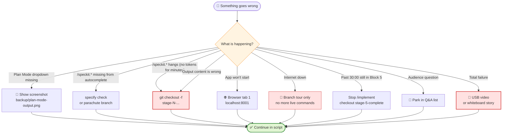

# Recovery Playbook (what to do if …)

> Default: **agent runs to completion.** Use an **emergency parachute** only for no token stream for several minutes, an explicit error, or 30:00 total wall-clock. Slow but still streaming = wait.

## 🧭 Emergency decision tree

> 💡 Panic flow: match symptom → do one action → say one sentence.

---

## 🚨 Plan Mode dropdown missing in VS Code Copilot Chat

**Symptom:** Chat mode dropdown shows Ask/Agent only; no "Plan".

**Immediate action:**
- Open `$HOME\demos\backup\plan-mode-output.png`
- Say: "Plan Mode is still rolling out, so I'll show you via screenshot."
- Explain the screenshot for 60 sec, then continue to Block 3

**Rationale:** The screenshot preserves the Plan Mode story without depending on rollout timing.

**Medium term (before the demo):** Use VS Code Insiders, or enable via the `chat.modes` setting.

---

## 🚨 Slash command `/speckit.*` does not appear in chat

**Symptom:** You type `/speckit.`; autocomplete shows nothing.

**Immediate action:**
- In terminal: `cd shortly && specify check` (shows integration status)
- If still nothing: `git checkout stage-2-after-specify`
- Say: "Copilot is re-indexing; if it stays missing, the branch is the emergency parachute."

**Rationale:** This is an indexing/integration problem; after the demo, check `specify init ... --integration copilot` or reload VS Code.

---

## 🚨 `/speckit.specify` stalls (no token stream for > 3 min) or errors out

**Symptom:** No token stream for > 3 min, or an explicit error appears.

**Immediate action:**
- `git checkout -f stage-2-after-specify`
- Say: "The agent is stuck — let's jump to the prepared state so we don't lose momentum."
- Open `.specify/specs/001-url-shortener/spec.md` and continue

**Rationale:** The `-f` flag discards partial live output. Slow but still streaming = wait.

---

## 🚨 `/speckit.plan` stalls (no token stream for > 3 min) or errors out

**Symptom:** No token stream for > 3 min, or an explicit error appears.

**Immediate action:**
- `git checkout -f stage-3-after-plan`
- Say: "The plan is versioned; I'll continue from the prepared branch."
- Open `.specify/specs/001-url-shortener/plan.md`, continue as planned

**Rationale:** Slow but still streaming = wait.

---

## 🚨 `/speckit.tasks` stalls (no token stream for > 2 min) or errors out

**Symptom:** No token stream for > 2 min, or an explicit error appears.

**Immediate action:**
- `git checkout -f stage-4-after-tasks`
- Say: "Tasks are versioned too; I'll continue from the prepared task list."
- Open `tasks.md`, continue

**Rationale:** Slow but still streaming = wait.

---

## 🚨 `/speckit.implement` stalls, errors, or hits 30:00

**Symptom:** No file activity in Explorer **and** no token stream in chat for > 3 minutes; explicit error; or wall-clock 30:00 while still mid-implementation.

**Immediate action:**
- Click the **Stop button** in Copilot Chat (red square at the top right of the chat input)
- `git checkout -f stage-5-complete`
- Say: "We've seen enough of the live build — let's jump to the finished state."
- Continue with the app demo (Block 6)

**Rationale:** `/implement` normally takes 5–8 minutes. The agent runs to completion unless it stalls, errors, or would push the demo past 30:00.

---

## 🚨 `/speckit.specify` produces completely different content than expected

**Symptom:** Spec suddenly talks about auth, multi-tenancy, etc.

**Immediate action:**
- `git checkout -f stage-2-after-specify` → continue
- Say: "This spec needs review; for the demo I'll show the reviewed state."

**Rationale:** Wrong content is a review finding; the emergency parachute keeps the story on track.

---

## 🚨 Emergency parachute branch jump fails ("uncommitted changes")

**Symptom:** Checkout refuses because live commands created or changed files.

**Immediate action:**
- Rerun with `git checkout -f stage-X-...` (discards working-tree changes)
- Say: "Live demo files are disposable; the branch is the known-good state."
- If you are paranoid: `git stash` → `git checkout stage-X-...` → later `git stash drop`

**Rationale:** Setup Checklist B3 ensures `git status` is clean **before demo start**; after that, live file churn is expected.

---

## 🚨 App won't start (`uvicorn` error)

**Symptom:** `uvicorn` errors or the local app will not start.

**Immediate action:**
- Switch to **Browser tab 1** (port 8001, started as backup in Setup B2)
- Say: "This is the version from the stage-5 branch — I'll show you the same endpoints."
- Continue with the running app

---

## 🚨 Click counter does not increment

**Symptom:** Redirect works, but `/stats/{code}` still shows 0.

**Immediate action:**
- Switch to the backup tab (port 8001) and show the working counter there.
- Say: "The fresh implementation may have a race condition; this is what tests are for."

---

## 🚨 Internet down → Copilot does not respond

**Symptom:** Copilot stops responding because the network is down.

**Immediate action:**
- Switch completely to branch tour, no more live commands
- Say: "No network, no LLMs — but all artifacts are versioned in the repo. Let's walk through the branches."
- In Wrap-up, say: "Specs are reviewable offline — that is part of the value."

---

## 🚨 Time is running out — past 30:00 and still in Block 5

**Symptom:** Total wall-clock hits 30:00 and `/implement` is still in Block 5.

**Immediate action:**
- Stop `/implement` (red square in chat input)
- `git checkout -f stage-5-complete`
- Say: "We've hit time; I'll use the emergency parachute so you still see the app."
- Tighten Wrap-up to 90 sec

**Rationale:** Before 30:00, slow but streaming is fine. At 30:00, protect the finish.

---

## 🚨 Audience question in the middle of Block 5

**Symptom:** Good question appears while `/implement` is still running or Block 5 is under way.

**Immediate action:**
- Say: "Great question — I'll park that in the Q&A list and answer it at the end so we still get to see the app live."
- Note the question (pen / sticky note on second screen)
- Return to the demo immediately

**Rationale:** The demo runs 25–30 min; discussion waits until Q&A.

---

## 🚨 Total failure (laptop crash, projector broken, etc.)

**Symptom:** Laptop, projector, or local environment is unusable.

**Immediate action:**
- Play video backup `shortly-demo.mp4` from USB stick on backup device
- If that also fails: tell the story with a whiteboard
  - **Two boxes at the top:** Plan Mode (tactical, in the moment) | SpecKit (strategic, over time)
  - **Pipeline below:** Constitution → Specify → Plan → Tasks → Implement
  - **Takeaway under both:** "The spec is the executable artifact"
- Say: "Live demos are honest — and reproducibility is exactly the advantage of Spec-Driven."

---

## 📜 Universal transition sentences (memorize)

1. "The agent is stuck — let's jump to the prepared state so we don't lose momentum."
2. "This is exactly why I version specs — the next state is ready in the branch."
3. "Live demos are honest — and reproducibility is exactly the advantage of Spec-Driven."
4. "I'll park this discussion in the Q&A so we still get to see the app."
