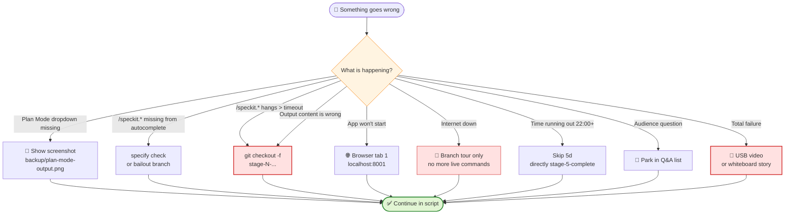

# Recovery Playbook (what to do if …)

> Every symptom has an **action (max 10 sec)** + a **sentence** you say while doing it. Scan for 5 min before the demo; keep it handy on a second screen during the demo.

## 🧭 Emergency decision tree

> 💡 Scroll to the **details below** for the exact sentence per symptom.

---

## 🚨 Plan Mode dropdown missing in VS Code Copilot Chat

**Symptom:** In the chat mode dropdown (at the top of the chat sidebar), there is only Ask/Agent, no "Plan".

**Immediate action:**
- Say: "Plan Mode is still rolling out, so I'll show you via screenshot."
- Open `$HOME\demos\backup\plan-mode-output.png`
- Explain the screenshot for 60 sec
- → directly continue to Block 3

**Medium term (before the demo):** Use VS Code Insiders, or enable via the `chat.modes` setting.

---

## 🚨 Slash command `/speckit.*` does not appear in chat

**Symptom:** You type `/speckit.` but autocomplete shows nothing.

**Immediate action:**
- Say: "The workspace is being re-indexed, one moment …"
- In terminal: `cd shortly && specify check` (shows integration status)
- If still nothing: **go directly to branch jump** `git checkout stage-2-after-specify`
- Say: "I'll take the prepared state — we'll see identical output in a moment."

**Root cause:** Either the Copilot integration was not installed (`specify init ... --integration copilot` was missing) or VS Code needs to be reloaded.

---

## 🚨 `/speckit.specify` runs longer than 90 sec

**Immediate action (at 90 sec):**
- Say: "So we don't wait for tokens, let's jump to the deterministic state."
- Terminal: `git checkout -f stage-2-after-specify`
- Open `.specify/specs/001-url-shortener/spec.md`
- Explain as planned

> The `-f` flag is important: live `/specify` may already have created files that must be discarded.

---

## 🚨 `/speckit.plan` runs longer than 90 sec

**Immediate action:**
- Say: "The plan is ready in the branch — the content is exactly what we are generating right now."
- `git checkout -f stage-3-after-plan`
- Open `.specify/specs/001-url-shortener/plan.md`, continue as planned

---

## 🚨 `/speckit.tasks` runs longer than 60 sec

**Immediate action:**
- `git checkout -f stage-4-after-tasks`
- Open `tasks.md`, continue

---

## 🚨 `/speckit.implement` is already running and you want to jump (planned cut!)

**This is NOT an error — this is choreography.** After watching for 30 sec:

1. Click the **Stop button in chat** (red square at the top right of the chat input). Otherwise `/implement` keeps running in the background and consumes quota.
2. **Say:** "That's it for live implementation — we're jumping to the final state."
3. **Terminal:** `git checkout -f stage-5-complete`
4. **Continue** with app demo

---

## 🚨 `/speckit.specify` produces completely different content than expected

**Symptom:** Spec suddenly talks about auth, multi-tenancy, etc.

**Immediate action:**
- Say: "This shows exactly why specs are reviewed — but for the demo I'll show you our reviewed state."
- `git checkout -f stage-2-after-specify` → continue

---

## 🚨 Git branch jump fails ("uncommitted changes")

**Immediate action:**
- Always use the `-f` flag: `git checkout -f stage-X-...` (discards working-tree changes)
- If you are paranoid: `git stash` → `git checkout stage-X-...` → later `git stash drop`

**Prevention:** Setup Checklist B3 ensures `git status` is clean **before demo start**. During the demo, live commands create new files — that is expected.

---

## 🚨 App won't start (`uvicorn` error)

**Immediate action:**
- Switch to **Browser tab 1** (port 8001, started as backup in Setup B2)
- Say: "This is the version from the stage-5 branch — I'll show you the same endpoints."
- Continue with the running app

---

## 🚨 Click counter does not increment

**Symptom:** Redirect works, but `/stats/{code}` still shows 0.

**Immediate action:**
- Say: "There is apparently a race condition in the fresh implementation — this is exactly what tests are for."
- Switch to the backup tab (port 8001) and show the working counter there.

---

## 🚨 Internet down → Copilot does not respond

**Immediate action:**
- Say: "No network, no LLMs — but all artifacts are versioned in the repo. Let's walk through the branches."
- Switch completely to branch tour, no more live commands
- Explicitly mention in the Wrap-up: "Specs are reviewable offline — that is part of the value."

---

## 🚨 Time is running out — still in Block 5 at 22:00

**Immediate action:**
- Skip part 5d (implementation branch) completely
- Directly: `git checkout stage-5-complete` and go to app demo
- Tighten Wrap-up to 90 sec

---

## 🚨 Audience question in the middle of Block 5

**Response strategy:**
- "Great question — I'll park that in the Q&A list and answer it at the end so we still get to see the app live."
- Note the question (pen / sticky note on second screen)
- **Do not get lost in discussion.** Demo slot is 25 min.

---

## 🚨 Total failure (laptop crash, projector broken, etc.)

**Immediate action:**
- Video backup `shortly-demo.mp4` from USB stick on backup device
- If that also fails: tell the story with a whiteboard
  - **Two boxes at the top:** Plan Mode (tactical, in the moment) | SpecKit (strategic, over time)
  - **Pipeline below:** Constitution → Specify → Plan → Tasks → Implement
  - **Takeaway under both:** "The spec is the executable artifact"

---

## 📜 Universal transition sentences (memorize)

1. "So we don't wait for tokens, let's jump to the deterministic state."
2. "This is exactly why I version specs — the next state is ready in the branch."
3. "Live demos are honest — and reproducibility is exactly the advantage of Spec-Driven."
4. "I'll park this discussion in the Q&A so we still get to see the app."
