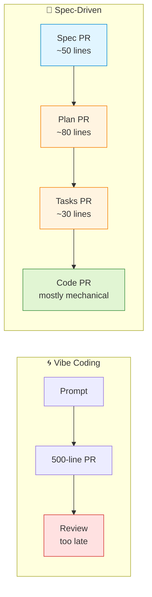
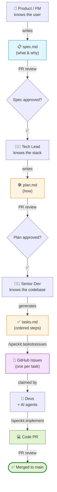

# SDD in a Distributed Team

> **Solo SDD is interesting. Team SDD is where the value compounds.**
>
> The 25-min demo shows the single-developer loop. This file shows what changes when you have multiple features, multiple humans, and AI agents working in parallel against the same repo.

## The mental shift

In vibe coding, the unit of work is a **prompt**. It vanishes after the response. Review happens on the resulting code — usually 500+ lines, often days later, by someone who wasn't in the conversation.

In Spec-Driven Development, the unit of work is an **artifact**: `spec.md`, `plan.md`, `tasks.md`. Each one is short, readable, and lives in a PR before any code is written. Review happens **three times**, on cheap and small artifacts, instead of once on expensive and large code.



## Multiple features, in parallel, no merge conflicts

SpecKit scaffolds each feature into its own folder:

```
.specify/
├── memory/
│   └── constitution.md                ← ONE per repo, shared across features
└── specs/
    ├── 001-url-shortener/             ← Dev A's feature
    │   ├── spec.md
    │   ├── plan.md
    │   └── tasks.md
    ├── 002-user-profiles/             ← Dev B's feature, in parallel
    │   ├── spec.md
    │   ├── plan.md
    │   └── tasks.md
    └── 003-rate-limiting/             ← AI agent's feature, in parallel
        ├── spec.md
        ├── plan.md
        └── tasks.md
```

**Why this matters:** spec/plan/tasks files live in disjoint folders. Three developers can run `/speckit.specify`, `/speckit.plan`, `/speckit.tasks`, and `/speckit.implement` on three different features at the same time **without ever touching the same file**. Merge conflicts in SpecKit artifacts are nearly impossible by construction.

The only shared artifact is `constitution.md` — and you change that rarely.

## Roles map to artifacts

The five commands aren't five steps for one person. They're a hand-off chain that maps naturally to team roles:



You don't need separate humans for each role — but the artifacts make the hand-off explicit. Even when one person plays all roles, putting on the "product hat" for `spec.md` and the "tech lead hat" for `plan.md` produces better thinking than mashing both concerns into a single prompt.

## What each PR review actually checks

| Artifact | Reviewer asks | Cheap to fix here? |
|----------|---------------|---------------------|
| `constitution.md` (rare) | Do these principles match how we want to build? | ✅ trivial — change words in one file |
| `spec.md` | Did we get the user story right? Did we forget edge cases? | ✅ minutes |
| `plan.md` | Why this stack? Does it respect the constitution? Are there cheaper alternatives? | ✅ minutes |
| `tasks.md` | Is the dependency order correct? Are tasks small enough to assign individually? | ✅ minutes |
| Code PR | Does the implementation match the tasks? Did anything sneak in? | 🔴 expensive — refactor or revert |

**The economic argument:** finding a wrong assumption in `spec.md` costs 10 minutes of rewriting. Finding the same wrong assumption in a 500-line code PR costs a day. SDD frontloads cheap review.

## AI agents as teammates

GitHub Copilot's cloud coding agent can pick up `/speckit.implement` on any PR you tag for it. The workflow:

1. Human writes spec → PR → merge.
2. Human (or AI) writes plan → PR → merge.
3. `/speckit.taskstoissues` creates issues for each task.
4. Label an issue `ai-implement`. Copilot's cloud agent claims it, runs `/speckit.implement` against that task's scope, opens a PR.
5. Human reviews the code PR (which is small, because it implements one task).

AI becomes a **junior dev who works async**. You assign work to it the same way you assign work to a human — through issues with clear context. The spec/plan/tasks chain *is* the context.

> **CLI variant:** the same `/speckit.*` commands run 1:1 in the GitHub Copilot CLI. A team member who lives in the terminal hands off the same way; the artifacts don't care which client wrote them.

## Constitution evolution

The constitution captures team agreements: "we use Postgres, not SQLite", "all endpoints need tests", "no client-side rendering", etc.

When team agreements change:

1. Open a PR that edits `.specify/memory/constitution.md`.
2. Discuss. Merge.
3. **The next feature's `/speckit.plan` automatically respects the new rules.**

Old features keep their old plan.md unless someone regenerates them. That's fine — the constitution is forward-looking guidance, not retroactive law.

## A week in the life (concrete example)

**Monday — Product writes specs.**
- PM opens 3 PRs, one per feature, each containing only `spec.md` for `001-url-shortener`, `002-profiles`, `003-rate-limit`.
- Tech Lead reviews each spec, suggests one edge case. PRs merged by noon.

**Tuesday — Tech lead writes plans.**
- Tech Lead runs `/speckit.plan` against each spec. Opens 3 PRs, one per `plan.md`.
- Devs review the plans, raise one question about whether `001` should use Redis. Discussion → no, sqlite. PRs merged.

**Wednesday — Senior dev generates tasks + routes to GitHub issues.**
- Runs `/speckit.tasks` on each feature.
- Runs `/speckit.taskstoissues` — 30 GitHub issues materialize, pre-assigned with context.
- 12 issues labelled `ai-implement` get picked up by Copilot's cloud agent overnight.

**Thursday — Code PRs land.**
- 12 PRs from the AI agent (small, one task each).
- 8 PRs from human devs.
- Each PR reviewed against `tasks.md` — does the diff match the task description? Mostly yes, takes ~5 min each.

**Friday — features merge.**
- All 3 features merge to main.
- PM uses the same `spec.md` files as release notes (they're already user-facing language).

## Anti-patterns to avoid

❌ **Skipping the constitution.** Without it, every feature picks its own stack and your codebase becomes a museum of trends.

❌ **Writing spec + plan + tasks in one prompt.** You lose the review checkpoints. Each one's value is being challengeable on its own.

❌ **Letting `/speckit.implement` run on un-reviewed tasks.** The tasks file is the contract between the team and the agent. Skip review and you get the same vibe-coded chaos, just routed through an extra file.

❌ **Treating the constitution as immutable.** It's a markdown file. PR it. Discuss. Update. Teams that never touch it eventually disagree with it silently.

❌ **Hiding the artifacts from non-engineers.** Specs are human-readable. Show them to PMs, designers, support. They'll catch product errors engineers miss.

## What stays the same as the 25-min demo

Everything technical. Same five commands. Same artifacts. Same constitution-driven discipline. The only change is **who** runs each command and **where** the artifact gets reviewed.

> The single-dev demo is a microcosm. The team workflow is the same loop, just unfolded across people and time.
