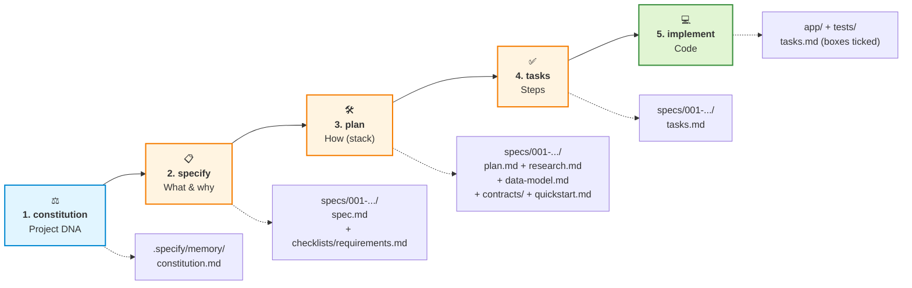
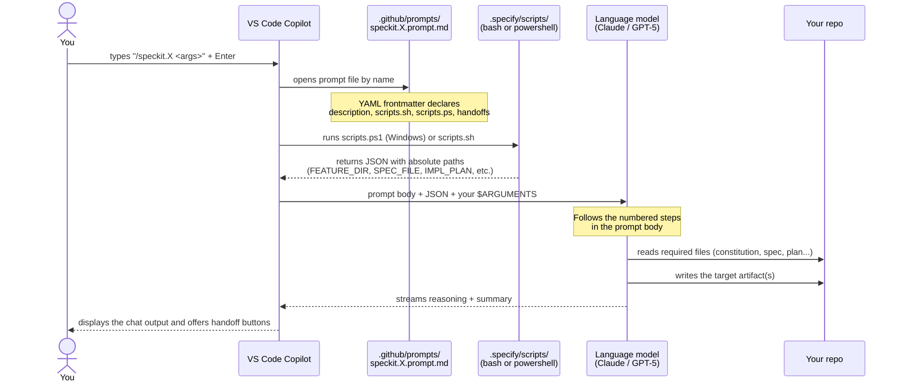
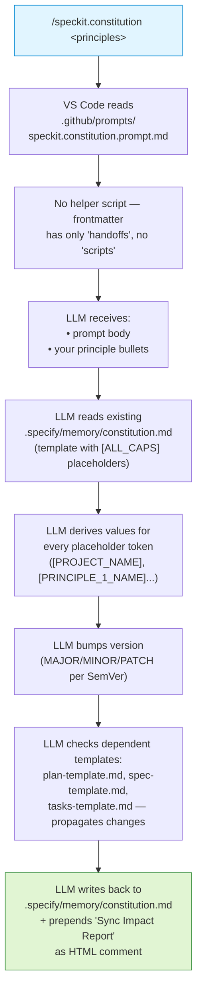
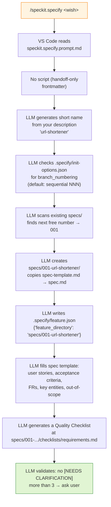
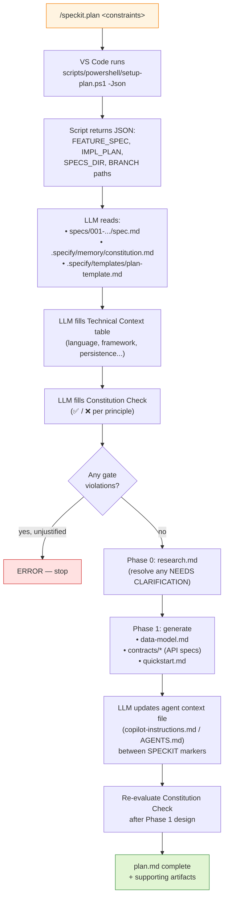
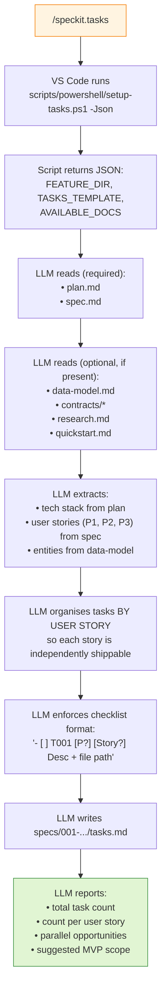
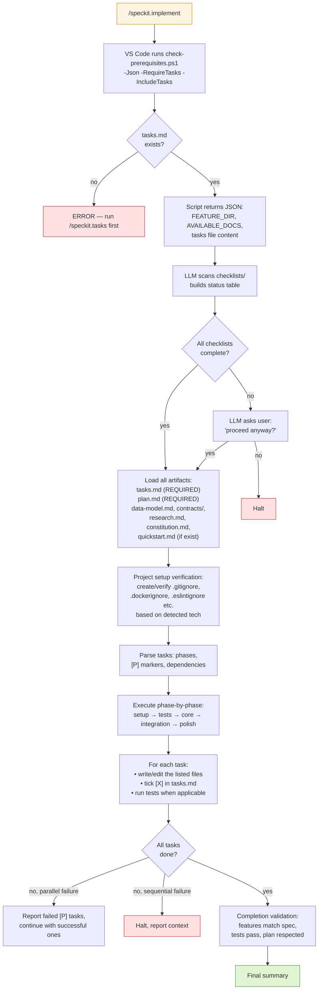

# Anatomy of a Complete SpecKit Run

> **What exactly happens when you type each `/speckit.*` slash command, end-to-end, on one real feature.**
> Companion reference to the 25-minute demo. Read this *after* watching the demo (or once before) to understand the mechanics behind every prompt.

## Why this document exists

The demo shows you the **outcome** of each SpecKit command: a file appears, the agent moves on. This document zooms in on the **mechanics**:

- Which file does VS Code Copilot actually open when you type `/speckit.constitution`?
- Which helper script runs before the LLM is even called?
- What exactly does the LLM read, write, and overwrite?
- Where do the artifacts live on disk after each step?
- Why was the command designed that way?

Every claim in this document is verified against the upstream prompt sources in [`github/spec-kit/templates/commands/`](https://github.com/github/spec-kit/tree/main/templates/commands). No hand-waving.

**Example feature throughout:** the URL shortener used in the demo (real spec, plan, tasks, and constitution excerpts pulled from [`04-plan-b/speckit-artifacts/`](./04-plan-b/speckit-artifacts/)).

---

## Pipeline overview



Every output is **Markdown in your git repo**. Every later step **reads** the outputs of earlier steps. This is what "Spec-Driven Development" means in practice: the spec, plan, and tasks are first-class artifacts, not session memory.

---

## Setting the stage — what `specify init` produced

Before you run any slash command, you ran this **once**:

```powershell
specify init shortly-live --integration copilot
```

This created the following layout (everything below this line is created by `specify init`, not by SpecKit at runtime):

```
shortly-live/
├── .git/                                ← regular git repo
├── .specify/
│   ├── memory/
│   │   └── constitution.md              ← TEMPLATE with [ALL_CAPS] placeholders
│   ├── scripts/
│   │   ├── bash/                        ← helper shell scripts (Linux/macOS)
│   │   │   ├── check-prerequisites.sh
│   │   │   ├── setup-plan.sh
│   │   │   ├── setup-tasks.sh
│   │   │   └── ...
│   │   └── powershell/                  ← Windows variants of the same scripts
│   │       ├── check-prerequisites.ps1
│   │       ├── setup-plan.ps1
│   │       └── ...
│   ├── templates/
│   │   ├── constitution-template.md     ← source for the constitution
│   │   ├── spec-template.md             ← source for every spec.md
│   │   ├── plan-template.md             ← source for every plan.md
│   │   └── tasks-template.md            ← source for every tasks.md
│   └── feature.json                     ← (created later by /speckit.specify)
└── .github/
    └── prompts/                         ← because --integration copilot
        ├── speckit.constitution.prompt.md
        ├── speckit.specify.prompt.md
        ├── speckit.plan.prompt.md
        ├── speckit.tasks.prompt.md
        ├── speckit.implement.prompt.md
        ├── speckit.taskstoissues.prompt.md
        ├── speckit.clarify.prompt.md     (optional, see appendix)
        ├── speckit.checklist.prompt.md   (optional)
        └── speckit.analyze.prompt.md     (optional)
```

Two things to internalise:

1. **Everything is files in your repo.** No daemon. No external service. `git diff` shows you exactly what SpecKit changes when you upgrade it or when you customize it.
2. **The slash commands are just markdown files** in `.github/prompts/`. VS Code reads them; nothing magical happens in the editor. If you `--integration claude`, the same content goes to `.claude/commands/` instead — identical behaviour, different folder.

> 📐 **Path note (modern vs older spec-kit):** Current `specify init` writes feature folders to **`specs/<NNN-name>/`** at the repo root. Some older guides (including parts of this repo's other docs that pre-date the May 2026 spec-kit release) show `.specify/specs/...`. If you ever lose track of the active feature path, look at **`.specify/feature.json`** — it is the authoritative pointer that all downstream commands consult.

---

## The general anatomy of any `/speckit.*` command

Every SpecKit slash command goes through the same five-stage lifecycle. Knowing this once removes the mystery from all of them.



**Key takeaway:** the slash command is just "**run script → assemble prompt → call LLM → LLM edits files**". The intelligence lives in the LLM and in the prompt body; the script only produces deterministic paths.

### What's in a prompt file?

A typical SpecKit prompt file (e.g. `speckit.plan.prompt.md`) looks like this:

```markdown
---
description: Execute the implementation planning workflow...
handoffs:
  - label: Create Tasks
    agent: speckit.tasks
    prompt: Break the plan into tasks
    send: true
scripts:
  sh: scripts/bash/setup-plan.sh --json
  ps: scripts/powershell/setup-plan.ps1 -Json
---

## User Input

```text
$ARGUMENTS
```

## Outline

1. Run `{SCRIPT}` from repo root and parse JSON for FEATURE_SPEC, IMPL_PLAN, SPECS_DIR, BRANCH.
2. Read FEATURE_SPEC and `/memory/constitution.md`. Load IMPL_PLAN template.
3. Execute plan workflow: fill Technical Context, fill Constitution Check, generate research.md...
...
```

Three things to spot:

| Frontmatter key | What it does |
|---|---|
| `description` | One-line summary shown in the slash-command picker |
| `scripts.sh` / `scripts.ps` | Helper script that runs **before** the LLM sees the prompt. Stdout is JSON. The body refers to it with `{SCRIPT}`. |
| `handoffs` | Buttons VS Code shows *after* the command completes ("Create Tasks", "Run Implement", etc.) |

The **body** is a numbered, step-by-step instruction list. The LLM follows it more reliably than free-form prose because each step is concrete.

---

## Step 1 — `/speckit.constitution`

> **Purpose:** establish project DNA. Run once per project; amend rarely.

### Trigger (live demo prompt)

```text
/speckit.constitution Create project principles focused on:
1. Minimal dependencies — only what is essential
2. Standard library first — prefer Python stdlib over third-party
3. Testability — every endpoint needs at least one test
4. Server-rendered HTML — no SPA, no build step
5. No external services — must run fully offline
6. Single-file modules where reasonable
7. Explicit over implicit — no magic frameworks
```

### What happens mechanically



### The crucial detail: constitution.md starts as a TEMPLATE

When `specify init` ran, it copied `.specify/templates/constitution-template.md` into `.specify/memory/constitution.md`. That copy contains placeholders like:

```markdown
# [PROJECT_NAME] Constitution

## Core Principles

### I. [PRINCIPLE_1_NAME]
[PRINCIPLE_1_BODY]

...

**Version:** [CONSTITUTION_VERSION] | **Ratified:** [RATIFICATION_DATE]
```

`/speckit.constitution` is fundamentally a **template-fill operation**: the LLM's job is to (a) parse your bullet points, (b) replace every `[ALL_CAPS_TOKEN]` with concrete text, (c) bump the version, (d) propagate changes through the related templates. It is NOT a free-form write.

### Real output excerpt (from our run)

```markdown
# Shortly Constitution

## Core Principles

### I. Minimal Dependencies
Use only what is strictly essential. Each new dependency must justify
its existence against a standard-library or zero-dep alternative.

### II. Standard Library First
Prefer Python standard library over third-party packages whenever the
difference in developer effort is acceptable. Specifically: persistence
uses `sqlite3` (stdlib), not SQLAlchemy.

[...skipped V principles...]

## Out of Scope (Permanent)
- Authentication / user accounts
- Docker / container orchestration
- ORM (SQLAlchemy, etc.) or database migrations (Alembic)
[...]

**Version:** 1.0.0 | **Ratified:** 2026-05-25
```

(Full file: [`04-plan-b/speckit-artifacts/constitution.md`](./04-plan-b/speckit-artifacts/constitution.md))

### Why this comes first

The constitution is read by **every** subsequent command:

- `/speckit.plan` reads it to fill the **Constitution Check** table (a pass/fail gate per principle)
- `/speckit.tasks` reads it indirectly via plan.md (Constitution Check propagates)
- `/speckit.implement` reads it (step 3 of implement.md says: *"IF EXISTS: Read /memory/constitution.md for governance constraints"*)

Without the constitution, every later step makes silent assumptions about stack, testing discipline, and scope. With it, the constraints are explicit and survive every regeneration.

---

## Step 2 — `/speckit.specify <feature description>`

> **Purpose:** turn a one-paragraph product wish into a structured spec the team can review **before** anyone touches code.

### Trigger (live demo prompt)

```text
/speckit.specify Build a URL shortener web service.
Users can submit a long URL via a form and receive a short code.
Visiting the short URL redirects to the original and increments
a click counter. A stats page shows the original URL, click count
and creation date for any code. Recent shortened URLs are listed
on the home page. Single-user, no auth, no expiry.
```

### What happens mechanically



### What was just created on disk

```
shortly-live/
├── specs/                              ← NEW
│   └── 001-url-shortener/              ← NEW (NNN auto-numbered)
│       ├── spec.md                     ← NEW (filled from template)
│       └── checklists/                 ← NEW
│           └── requirements.md         ← NEW (quality gate)
└── .specify/
    └── feature.json                    ← NEW (points at active feature)
```

### Real output excerpt

```markdown
# Feature Specification: URL Shortener with Click Stats

**Feature Branch:** `001-url-shortener`
**Status:** Draft → Reviewed
**Input:** Build a URL shortener web service...

## User Scenarios & Testing

### Primary User Story
As a single user, I want to paste a long URL, get a short code back,
share that short URL, and later see how often it has been clicked.

### Acceptance Scenarios

1. **Shorten a URL**
   - **Given** the home page is open
   - **When** I paste `https://example.com/very/long/path?q=1` and submit
   - **Then** a short code (6 alphanumeric chars) is displayed...

## Functional Requirements

- **FR-001:** System MUST accept a long URL via `POST /shorten`...
- **FR-002:** Short codes MUST be 6 alphanumeric characters...
[...8 FRs total...]
```

(Full file: [`04-plan-b/speckit-artifacts/spec.md`](./04-plan-b/speckit-artifacts/spec.md))

### What the auto-generated quality checklist looks like

```markdown
# Specification Quality Checklist: URL Shortener

## Content Quality
- [x] No implementation details (languages, frameworks, APIs)
- [x] Focused on user value and business needs
- [x] Written for non-technical stakeholders
- [x] All mandatory sections completed

## Requirement Completeness
- [x] No [NEEDS CLARIFICATION] markers remain
- [x] Requirements are testable and unambiguous
- [x] Success criteria are measurable
- [x] All acceptance scenarios are defined
- [x] Edge cases are identified
- [x] Scope is clearly bounded
[...]
```

This checklist is read by `/speckit.implement` later — if items are unchecked, implement asks "proceed anyway?".

### Why no tech stack in the spec

The prompt body explicitly enforces this:

> *"For each item: No implementation details (languages, frameworks, APIs); Focused on user value and business needs; Written for non-technical stakeholders."*

This is by design. The spec is **product**: PMs, designers, and customer-success can review it. Frameworks come in step 3, where they can be argued about in isolation.

---

## Step 3 — `/speckit.plan <tech constraints>`

> **Purpose:** turn the spec into a concrete technical plan, gated by the constitution.

### Trigger (live demo prompt)

```text
/speckit.plan Use Python 3.12 with FastAPI as the only web framework.
Use the sqlite3 standard library for persistence (no SQLAlchemy, no
Alembic). Use Jinja2 templates for minimal server-rendered HTML with
Pico.css from CDN. Tests with pytest using FastAPI's TestClient.
Single file app/main.py is preferred. Do NOT introduce: Docker,
Redis, background workers, auth, frontend build tools, or external
services.
```

### What happens mechanically



### What was just created on disk

```
specs/001-url-shortener/
├── spec.md                  (unchanged)
├── plan.md                  ← NEW
├── research.md              ← NEW (decisions w/ alternatives considered)
├── data-model.md            ← NEW (entities + fields + relationships)
├── contracts/               ← NEW
│   └── api.yaml             ← NEW (OpenAPI-ish or whatever fits the project)
├── quickstart.md            ← NEW (integration test scenarios)
└── checklists/
    └── requirements.md      (unchanged)
```

> ⚠ **Reality check:** the simplified `plan.md` excerpted below combines what current spec-kit usually splits across `plan.md + research.md + data-model.md`. The demo intentionally uses a condensed version so the audience can grasp it in 30 seconds. A real `/speckit.plan` run typically writes 4–5 files in this step.

### Real output excerpt

```markdown
# Implementation Plan: URL Shortener

**Branch:** `001-url-shortener` | **Spec:** `spec.md`

## Technical Context

| Aspect              | Choice                  | Justification                              |
|---------------------|-------------------------|--------------------------------------------|
| Language            | Python 3.12             | Constitution: minimal deps; stdlib is rich |
| Web framework       | FastAPI                 | Stated requirement; sync routes sufficient |
| Persistence         | sqlite3 (stdlib)        | Constitution II: stdlib first              |
| Templates           | Jinja2                  | Server-rendered per Constitution IV        |
| Testing             | pytest + TestClient     | Constitution III                           |

## Constitution Check (PASS)

| Principle                   | Status | Notes                                |
|-----------------------------|--------|--------------------------------------|
| I — Minimal deps            | ✅     | 4 runtime deps total                 |
| II — Stdlib first           | ✅     | sqlite3 over SQLAlchemy              |
| III — Testability           | ✅     | TestClient covers all routes         |
| IV — Server-rendered HTML   | ✅     | Jinja2, no SPA                       |
| V — Offline                 | ✅     | Pico.css from CDN is opt-in          |
| VI — Single-file modules    | ✅     | app/main.py + app/db.py              |
| VII — Explicit over implicit| ✅     | Manual SQL, no ORM                   |
```

(Full file: [`04-plan-b/speckit-artifacts/plan.md`](./04-plan-b/speckit-artifacts/plan.md))

### The killer feature: the Constitution Check

Every plan has a **Constitution Check** table. The LLM goes principle-by-principle and either ticks `✅` (and justifies briefly) or marks `❌` and **must justify the violation explicitly** — the prompt body says:

> *"Evaluate gates (ERROR if violations unjustified)"*

This is what makes the spec→plan handoff trustworthy: you can't accidentally drift away from the constitution without leaving a paper trail in plan.md that a reviewer can challenge in the PR.

---

## Step 4 — `/speckit.tasks`

> **Purpose:** decompose the plan into a strict, dependency-ordered checklist of atomic tasks.

### Trigger

```text
/speckit.tasks
```

That's it. No arguments. The plan and spec already contain everything the LLM needs.

### What happens mechanically



### The strict task format

Every task line **must** follow:

```text
- [ ] T001 [P?] [US?] Description with file path
```

| Component | Rule |
|---|---|
| `- [ ]` | Markdown checkbox — `/speckit.implement` ticks it when done |
| `T001` | Sequential ID in execution order |
| `[P]` | Optional — task can run in parallel (different files, no dep on incomplete tasks) |
| `[US1]` | Optional — required for tasks inside a user-story phase, maps to spec.md priority |
| Description | Concrete action, **must include the exact file path** |

This format is not aesthetic — it enables `/speckit.implement` to parse the file deterministically, schedule parallel-marked tasks together, and tick boxes as it goes.

### Phase structure

| Phase | Contents |
|---|---|
| **Phase 1: Setup** | Project init (pyproject.toml, gitignore, package skeletons) |
| **Phase 2: Foundational** | Blocking prerequisites for all user stories (e.g. db schema) |
| **Phase 3+: User stories** | One phase per P1, P2, P3... — independently shippable |
| **Final Phase: Polish** | Cross-cutting concerns (logging, perf, docs) |

### Real output excerpt

```markdown
# Tasks: URL Shortener

**Input:** plan.md, spec.md   |   **Total tasks:** 14

## Phase 1: Project Scaffold
- [ ] T001 Create pyproject.toml with deps fastapi, uvicorn[standard]...
- [ ] T002 Create app/__init__.py (empty) and tests/__init__.py (empty) [P]
- [ ] T003 Add shortly.db, .venv, __pycache__/ to .gitignore [P]

## Phase 2: Persistence Layer
- [ ] T004 Implement app/db.py with: get_conn(), init_db(),
  insert_url(), get_url(), increment_clicks(), list_recent()

## Phase 3: Routes
- [ ] T005 Implement app/main.py skeleton: FastAPI app...
- [ ] T006 Implement GET / returning index.html with recent list
- [ ] T007 Implement POST /shorten: validate, generate code, retry on collision
- [ ] T008 Implement GET /{code}: lookup, 404 if missing, increment_clicks
- [ ] T009 Implement GET /stats/{code}

## Phase 4: Templates
- [ ] T010 Create app/templates/index.html [P]
- [ ] T011 Create app/templates/stats.html [P]

## Phase 5: Tests
- [ ] T012 tests/test_app.py: fixture for fresh in-memory DB
- [ ] T013 Test cases: shorten/redirect/stats/404/400

## Phase 6: Manual Verification
- [ ] T014 Run uv run uvicorn app.main:app --reload; manual check

## Dependency Graph

T001 → T002, T003 (parallel)
T004 → T005 → T006, T007, T008, T009 (sequential — same file)
T010, T011 (parallel, depend on T005 contract)
T012 → T013 (sequential — same file)
T014 (after all above)
```

(Full file: [`04-plan-b/speckit-artifacts/tasks.md`](./04-plan-b/speckit-artifacts/tasks.md))

### Why this matters for teams

The strict format is the unlock for the **team workflow** (covered in detail in [`06-team-workflow.md`](./06-team-workflow.md)):

- **`/speckit.taskstoissues`** can mechanically parse tasks.md and create one GitHub issue per task — because every task line is a uniform shape.
- **`[P]` markers** tell humans and AI agents what can be worked in parallel without merge conflicts.
- **`[US1]` labels** mean Dev A can take all of US1 while Dev B takes all of US2 — the user stories are designed to be independent.

> ⚠ The local single-dev path (`/speckit.implement`) and the team path (`/speckit.taskstoissues` + cloud agent) are **alternatives, not a chain**. Implement reads `tasks.md` and works through all of it; the issue path lets the work be picked up piecewise. Pick one per feature.

---

## Step 5 — `/speckit.implement`

> **Purpose:** read all the planning artifacts and actually write the code.

### Trigger

```text
/speckit.implement
```

No arguments needed — the active feature is in `.specify/feature.json`, and `tasks.md` is the to-do list.

### What happens mechanically



### What `/speckit.implement` is and isn't

| ✅ It IS… | ❌ It is NOT… |
|---|---|
| A full-tasks-list executor: runs **all** tasks in `tasks.md` in one session | A per-task command — no `/speckit.implement T005` mode exists |
| Aware of `[P]` markers — runs parallel-safe tasks together | A continuous mode — when it ends, it ends; re-running starts from scratch unless tasks.md has `[X]` boxes |
| Following TDD when tests are present in tasks (tests first, then code) | A debugger — if a test fails after implementation, it usually self-corrects, but for stubborn failures you take over |
| Updating `tasks.md` with `[X]` after each completed task | Reading GitHub issues — see [`06-team-workflow.md`](./06-team-workflow.md) for the issue path |

### Real result on disk (after a clean run)

```
shortly-live/
├── pyproject.toml                      ← T001 created
├── .gitignore                          ← T003 updated
├── app/
│   ├── __init__.py                     ← T002
│   ├── main.py                         ← T005, T006, T007, T008, T009
│   ├── db.py                           ← T004
│   └── templates/
│       ├── index.html                  ← T010
│       └── stats.html                  ← T011
├── tests/
│   ├── __init__.py                     ← T002
│   └── test_app.py                     ← T012, T013
├── shortly.db                          ← created on first run (gitignored)
├── specs/001-url-shortener/
│   ├── spec.md
│   ├── plan.md
│   ├── tasks.md                        ← all boxes now [X]
│   └── ...
└── .specify/                           (unchanged)
```

5/5 tests pass, app boots cleanly on `uv run uvicorn app.main:app --reload`.

### Why the "agent runs to completion" framing matters

This step is the only one in the pipeline where you wait visibly (5–8 min in our case, 30+ min for larger features). The temptation is to interrupt and "help". Don't.

The whole pedagogical point of the demo's Block 5d is to **watch the agent work** while you narrate the spec → plan → tasks → code mapping. The artifacts you spent the previous 4 commands building are now being **honoured** in real time. The audience sees architectural decisions becoming code, not magic happening behind a `npm install` spinner.

---

## What the final repo looks like

After one complete run on the URL shortener:

```
shortly-live/
├── .git/
├── .specify/                          ← infrastructure (created once by `specify init`)
│   ├── memory/constitution.md         ← project DNA
│   ├── scripts/                       ← helper scripts
│   ├── templates/                     ← source templates
│   └── feature.json                   ← active feature pointer
├── .github/prompts/                   ← all slash commands as .prompt.md
├── specs/
│   └── 001-url-shortener/             ← the feature
│       ├── spec.md
│       ├── plan.md
│       ├── research.md                (typically generated by plan)
│       ├── data-model.md              (typically generated by plan)
│       ├── contracts/                 (typically generated by plan)
│       ├── quickstart.md              (typically generated by plan)
│       ├── tasks.md                   (all [X])
│       └── checklists/requirements.md
├── app/                                ← THE CODE (created by implement)
├── tests/                              ← THE TESTS
├── pyproject.toml
├── .gitignore
└── shortly.db                          (runtime artifact, gitignored)
```

Everything in `specs/001-url-shortener/` is **reviewable in PRs** before any code lands. Everything in `.specify/` is infrastructure you read once and then forget.

---

## Optional commands you might encounter

The five commands above are the canonical pipeline. `specify init --integration copilot` also installs three optional commands you'll see suggested as **handoff buttons** after various stages:

| Command | When to use it | What it does |
|---|---|---|
| `/speckit.clarify` | After `/speckit.specify`, before `/speckit.plan` | Walks through `[NEEDS CLARIFICATION]` markers in the spec and resolves them interactively |
| `/speckit.checklist` | After `/speckit.plan` | Creates an additional domain-specific checklist (e.g. security review, accessibility) under `specs/.../checklists/` |
| `/speckit.analyze` | After `/speckit.tasks`, before `/speckit.implement` | Runs a cross-artifact consistency check: do the tasks actually cover all FRs in the spec? Are any plan decisions orphaned? |
| `/speckit.taskstoissues` | After `/speckit.tasks` (team workflow only) | Creates one GitHub issue per task via the GitHub MCP server. See [`06-team-workflow.md`](./06-team-workflow.md) for the full team workflow. |

Skip them in the demo; mention them in Q&A if asked.

---

## Glossary

| Term | Meaning |
|---|---|
| **Prompt file** | A `.prompt.md` file in `.github/prompts/` (or `.claude/commands/` etc.). YAML frontmatter declares description, script, handoffs; body is a numbered instruction list for the LLM. |
| **`.specify/`** | Local SpecKit infrastructure folder: helper scripts, source templates, constitution, active-feature pointer. Edit `memory/constitution.md`; otherwise leave alone unless customising SpecKit itself. |
| **`.github/prompts/`** | Where VS Code Copilot looks for custom slash commands. `specify init --integration copilot` writes here. |
| **`check-prerequisites.sh`** | Helper script SpecKit uses to verify the active feature exists and return JSON paths the LLM consumes. Variants exist for setup-plan and setup-tasks. |
| **Feature folder** | `specs/<NNN>-<short-name>/`, holding all artifacts for one feature. Created by `/speckit.specify`. |
| **`.specify/feature.json`** | Single source of truth for "what is the active feature directory?". Updated by `/speckit.specify`; consumed by every later command. |
| **Constitution** | Project-wide principles in `.specify/memory/constitution.md`. Versioned (SemVer). Read by every later command. |
| **Sync Impact Report** | An HTML comment `/speckit.constitution` prepends to constitution.md when it amends, listing what changed and which dependent templates need updates. |
| **Handoff** | A button VS Code shows after a slash command completes, suggesting the next command (e.g. "Create Tasks" after `/speckit.plan`). Declared in the prompt file's `handoffs:` frontmatter. |

---

## Common confusions

### `/plan` ≠ `/speckit.plan`

VS Code 1.105+ ships a **built-in** `/plan` slash command that switches the Chat view to the [Plan agent](https://code.visualstudio.com/docs/copilot/agents/planning) — a generic planning persona that stores its output in **session memory** (`/memories/session/plan.md`, gone after the chat).

`/speckit.plan` is the SpecKit prompt file at `.github/prompts/speckit.plan.prompt.md` that writes a persistent `plan.md` into your feature folder. Same idea, completely different lifetime.

### `/init` ≠ `specify init`

VS Code's built-in `/init` slash command generates a `.github/copilot-instructions.md` ([custom instructions](https://code.visualstudio.com/docs/copilot/customization/custom-instructions)) for your repo — always-on instructions for chat.

`specify init` is the SpecKit CLI command that bootstraps `.specify/` + `.github/prompts/` in a fresh repo. Two different tools, two different scopes.

### `/speckit.implement` reads `tasks.md`, not GitHub issues

Verified in [`implement.md`](https://github.com/github/spec-kit/blob/main/templates/commands/implement.md) step 3: *"REQUIRED: Read tasks.md for the complete task list and execution plan"*. GitHub issues never appear in the prompt. The implement path and the issues path are alternatives; the cloud agent that picks up an issue does **not** invoke `/speckit.implement` per issue — it implements that one task directly using spec.md + plan.md as context.

### `specs/` vs `.specify/specs/`

Current spec-kit (May 2026) puts feature folders at **`specs/<NNN-name>/`** at the repo root. Older guides and some legacy projects (including parts of this demo repo's other docs) use **`.specify/specs/...`**. If unsure, read `.specify/feature.json` — it holds the authoritative path that all commands consult.

### Tasks are not back-referenced from issues after `/speckit.taskstoissues`

Out of the box, `/speckit.taskstoissues` is a one-way mapping: tasks.md stays unchanged, no issue numbers get written back. If you want bidirectional linking, fork the prompt file or chain a follow-up prompt. See [`06-team-workflow.md`](./06-team-workflow.md) for patterns.

---

## Sources

- All prompt-body claims are verified against [`github/spec-kit/templates/commands/`](https://github.com/github/spec-kit/tree/main/templates/commands) at the time of writing (May 2026).
- Real artifact excerpts are pulled from [`04-plan-b/speckit-artifacts/`](./04-plan-b/speckit-artifacts/) — these are the actual files generated when this repo was set up for the demo.
- VS Code Copilot terminology follows [VS Code 1.121 docs](https://code.visualstudio.com/docs/copilot/overview) (released 2026-05-20).
